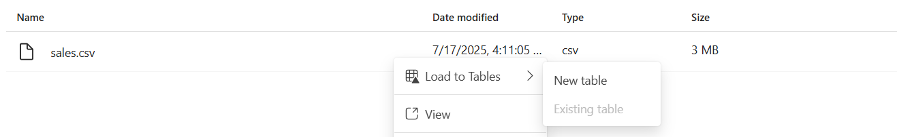
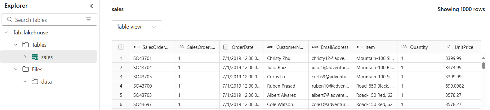
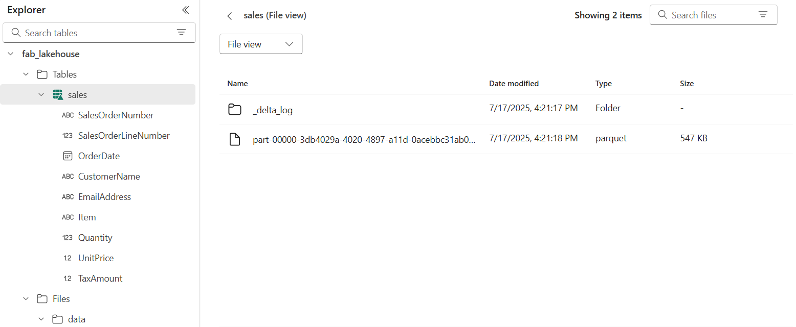
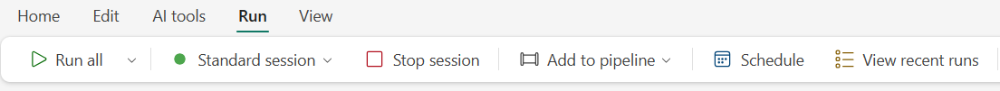
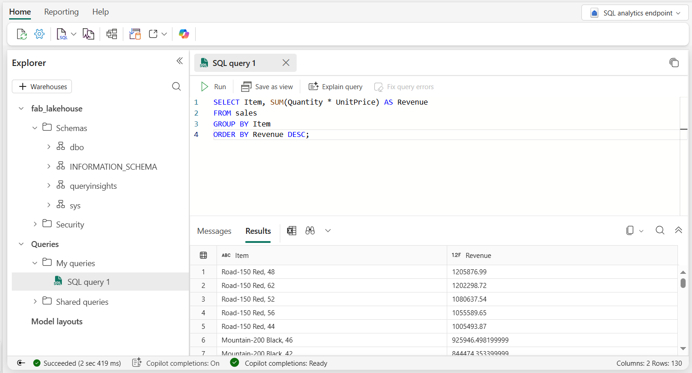
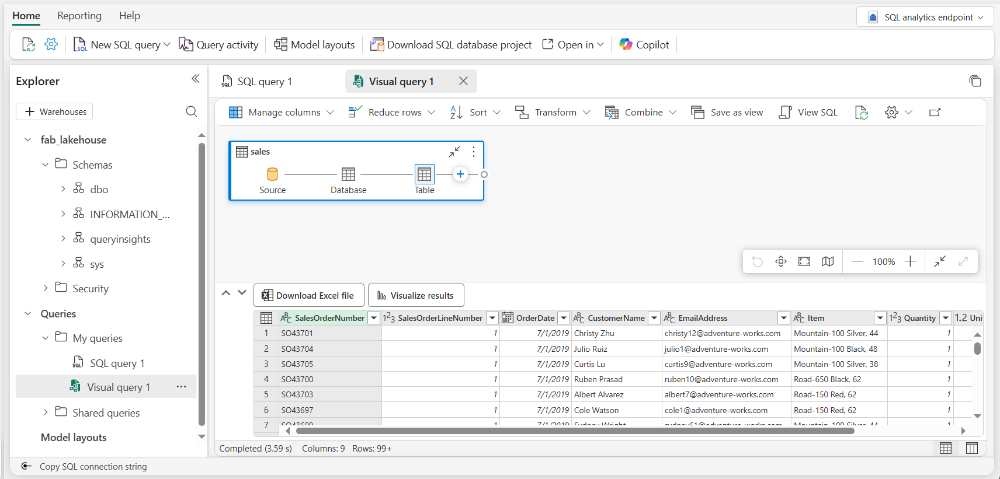
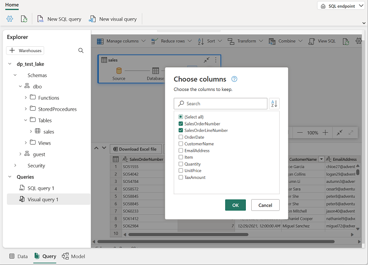
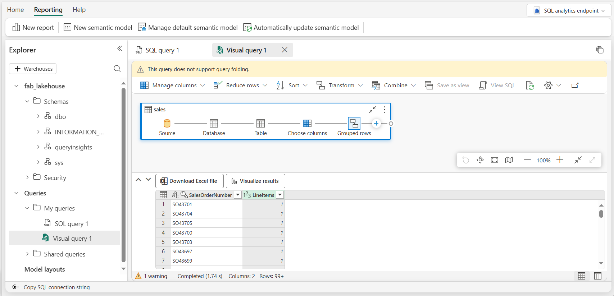

# Lab 01 ~ Create a Microsoft Fabric Lakehouse

!!! info "For this lab, you will access the QA Platform and sign in using the credentials provided."

!!! warning "You must use an incognito or private browser window to avoid conflicts with any work or personal Microsoft accounts you may already be signed in to."


## Step 1: Create a workspace

Before working with data in Fabric, you need to create a workspace.

1. In the navigation pane on the left, select **Workspaces** (the icon looks similar to &#128455;).

2. Select **+ New workspace**, then create a workspace using the naming format below:

    - Start the name with `fab_workspace`
    - Add random numbers to make it unique (for example, `fab_workspace123`)
    - Leave all other options as the default values
    - Click **Apply**

3. Your workspace should be empty, and look similar to this:

    !!! quote ""
        


## Step 2: Create a lakehouse

Now that you have a workspace, it's time to create a data lakehouse into which you'll ingest data.

1. On the menu bar on the left, select **Create**. In the *New* page, under the *Data Engineering* section, select **Lakehouse**.

    - Name the lakehouse `fab_lakehouse`
    - Leave **Lakehouse schemas** selected.

    !!! tip "If the **Create** option is not pinned to the sidebar, you need to select the ellipsis (…) option first."

    After a minute or so, a new empty lakehouse will be created.

    !!! quote ""
        

2. View the new lakehouse, and note that the **Lakehouse explorer** pane on the left enables you to browse tables and files in the lakehouse:

    - The **Tables** folder contains tables that you can query using SQL semantics. Tables in a Microsoft Fabric lakehouse are based on the open source *Delta Lake* file format, commonly used in Apache Spark.

    - The **Files** folder contains data files in the OneLake storage for the lakehouse that aren't associated with managed delta tables. You can also create *shortcuts* in this folder to reference data that is stored externally.

Currently, there are no tables or files in this lakehouse.


## Step 3: Upload a file

Fabric provides multiple ways to load data into the lakehouse, including built-in support for pipelines that copy data from external sources and data flows (Gen 2) that you can define using visual tools based on Power Query. However one of the simplest ways to ingest small amounts of data is to upload files or folders from your local computer (or lab VM if applicable).

1. In the **Explorer** pane of the lakehouse, click the **...** menu for the **Files** folder and select **New subfolder**.

    - Name the new subfolder: `data`
    - Click **Create**

2. Locate the `sales.csv` file in the `files` directory on your Virtual Machine.

    - If you are not using a VM, or the file is not there, download it from: https://raw.githubusercontent.com/qaalabs/fabric/refs/heads/main/data/sales.csv

    !!! note
        - To download the file, open a new tab in the browser and paste in the URL.
        - Right click anywhere on the page containing the data and select "Save as" to save the data as a CSV file.

3. In the **...** menu for the new **data** folder, select **Upload** and **Upload files**.

    - Then upload the **sales.csv** file from your local computer (or lab VM if applicable).

4. After the file has been uploaded, select the **Files/data** folder and verify that the **sales.csv** file has been uploaded, as shown here:

    !!! quote ""
        

5. Select the **sales.csv** file to see a preview of its contents.

    !!! tip "If the **sales.csv** file does not automatically appear, in the **...** menu for the **data** folder, select **Refresh**."


## Step 4: Explore shortcuts

In many scenarios, the data you need to work with in your lakehouse may be stored in some other location. While there are many ways to ingest data into the OneLake storage for your lakehouse, another option is to instead create a shortcut. Shortcuts enable you to include externally sourced data in your analytics solution without the overhead and risk of data inconsistency associated with copying it.

1. In the **...** menu for the **Files** folder, select **New shortcut**.

2. View the available data source types for shortcuts.

    - Then close the **New shortcut** dialog box without creating a shortcut.


## Step 5: Load file data into a table

The sales data you uploaded is in a file, which you can work with directly by using Apache Spark code. However, in many scenarios you may want to load the data from the file into a table so that you can query it using SQL.

1. In the **Explorer** pane, select the **Files/data** folder so you can see the **sales.csv** file it contains.

2. In the **...** menu for the **sales.csv** file, select **Load to Tables** > **New table**.

    !!! quote ""
        

3. In **Load to table** dialog box:

    - Make sure that the new table name is : `sales`
    - Column header should be selected, and seperator should be a comma.
    - Click **Load**.

    Wait for the table to be created and loaded.

    !!! tip "If the `sales` table does not automatically appear, in the **...** menu for the **Tables** folder, select **Refresh**."

4. In the **Explorer** pane, select the `sales` table that has been created to view the data:

    !!! quote ""
        

5. In the **...** menu for the `sales` table, select **View files** to see the underlying files for this table:

    !!! quote ""
        

    !!! info ""
        Files for a delta table are stored in *Parquet* format, and include a subfolder named `_delta_log` in which details of transactions applied to the table are logged.


## Step 6: Use a notebook to query tables

Fabric notebooks let you write and run code directly against your lakehouse tables using Apache Spark. This is useful for more complex transformations and analysis beyond what SQL alone can do.

1. On the **Home** tab of your lakehouse, select **Open notebook** > **New notebook**.

    At the top-right of the Lakehouse page:

    - Select **Analyze data with** dropdown and choose: **Notebook** > **New notebook**

    !!! quote ""
        

2. In the notebook menu bar, use the ⚙️ **Settings** icon to view the notebook settings.

    - Then set the **Name** of the notebook to `Explore Sales`
    - Close the settings pane to save the changes.

3. In the first cell, enter the following code to load and display the sales table:

    ```python
    df = spark.read.table("sales")
    display(df)
    ```

4. Use the :material-play: **(Run cell)** button to run the cell.

    - It will take a moment to start the Spark session the first time.

    !!! warning "If you see an `InvalidHttpRequest [TooManyRequestsForCapacity]` error:"
        The **View files** action in the previous step may have left a Spark session running in the background. To fix this:

        - In the left navigation bar, select **Monitor**
        - Find any activity that is still running and cancel it
        - Return to your notebook and run the cell again

    !!! success "The sales table should be displayed as an interactive grid below the cell."

5. Below the interactive grid, click **+ Code** to add a new code cell, and enter the following code to calculate revenue by item:

    ```python
    from pyspark.sql.functions import col, sum, round

    revenue = (df.groupBy("Item")
                 .agg(round(sum(col("Quantity") * col("UnitPrice")), 2).alias("Revenue"))
                 .orderBy("Revenue", ascending=False))

    display(revenue)
    ```

6. Run the new cell and review the results.


7. After exploring the notebook, select the **Run** tab above the ribbon and select **Stop session**.
    - This stops the compute resource being used by the notebook.

    !!! quote ""
        


## Step 7: Use SQL to query tables

When you create a lakehouse and define tables in it, a SQL endpoint is automatically created through which the tables can be queried using SQL `SELECT` statements.

1. In the left navigation bar, return to your lakehouse `fab_lakehouse`.

2. At the top-right of the Lakehouse page, select **Analyze data with** and choose **SQL analytics endpoint**.

    - Then wait a short time until the SQL analytics endpoint for your lakehouse opens in a visual interface from which you can query its tables.

2. Use the **New SQL query** button to open a new query editor, and enter the following SQL query:

    ```sql
    SELECT Item, SUM(Quantity * UnitPrice) AS Revenue
    FROM sales
    GROUP BY Item
    ORDER BY Revenue DESC;
    ```

3. Use the :material-play: **Run** button to run the query and view the results, which should show the total revenue for each product.

    !!! quote ""
        

    !!! success "You should see the same revenue totals per item that you saw in the notebook."

## Step 8: Create a visual query

While many data professionals are familiar with SQL, those with Power BI experience can apply their Power Query skills to create visual queries.

1. On the toolbar of the `fab_lakehouse`, expand the **New SQL query** option and select **New visual query**.

2. Drag the `sales` table (under dbo > Tables) to the new visual query editor pane that opens to create a Power Query as shown here:

    !!! quote ""
        

3. In the **Manage columns** menu, select **Choose columns**.

    - Then select only the **SalesOrderNumber** and **SalesOrderLineNumber** columns. Click **OK**

    !!! quote ""
        

4. in the **Transform** menu, select **Group by**. Then group the data by using the following **Basic** settings:

    - **Group by**: SalesOrderNumber
    - **New column name**: `LineItems`
    - **Operation**: Count distinct values
    - **Column**: SalesOrderLineNumber (*if not greyed out*)

    When you're done, the results pane under the visual query shows the number of line items for each sales order.

    !!! quote ""
        

---

## Clean up resources

In this exercise, you have created a lakehouse and imported data into it. You've seen how a lakehouse consists of files and tables stored in a OneLake data store. The managed tables can be queried using SQL.

Once you've finished exploring your lakehouse, you should delete the workspace you created for this exercise.

1. Navigate to Microsoft Fabric in your browser.

2. In the bar on the left, select the icon for your workspace to view all of the items it contains.

3. Select **Workspace settings** and in the **General** section, scroll down and select **Remove this workspace**.

4. Select **Delete** to delete the workspace.

---
<small><b>Source:
https://microsoftlearning.github.io/mslearn-fabric/Instructions/Labs/01-lakehouse.html
</b></small>
