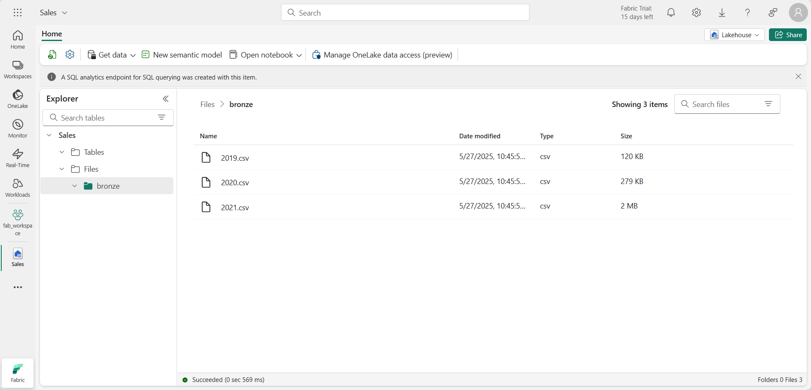
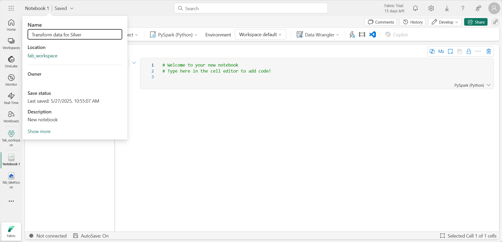
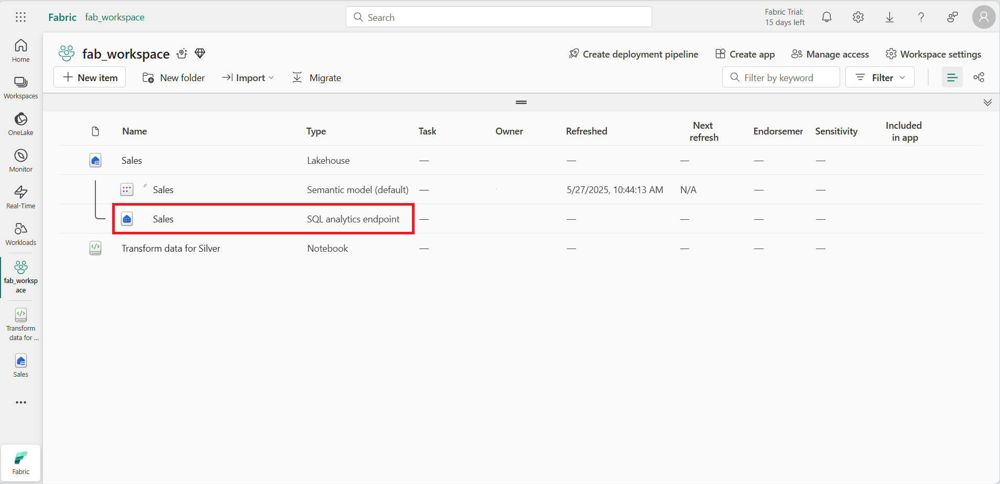
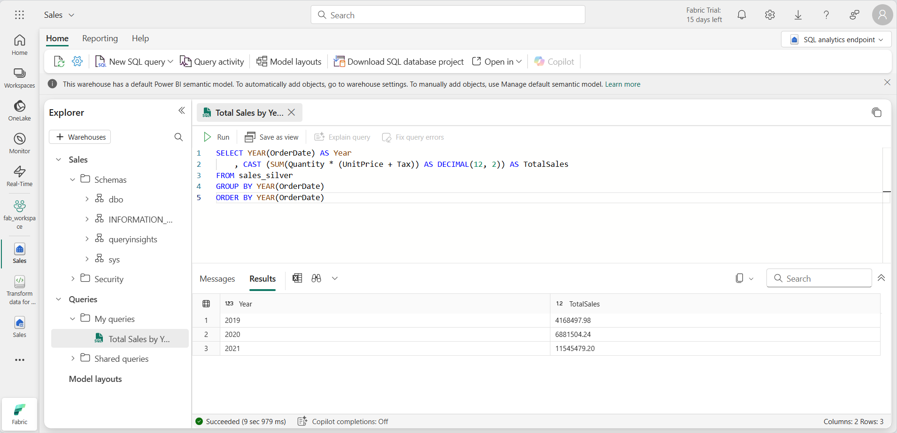
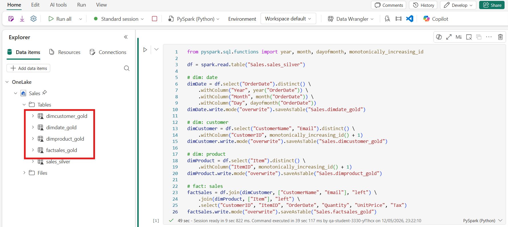
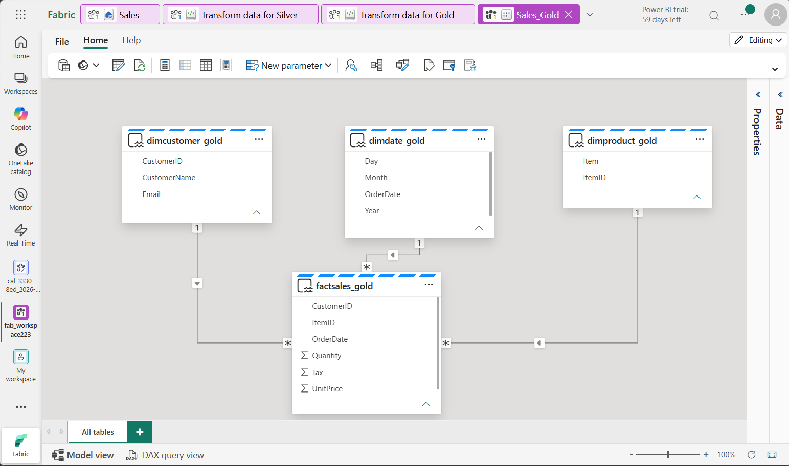

# Lab 03b ~ Create Medallion Architecture in a Fabric Lakehouse

!!! info "For this lab, you will access the QA Platform and sign in using the credentials provided."

!!! warning "You must use an incognito or private browser window to avoid conflicts with any work or personal Microsoft accounts you may already be signed in to."


## Step 1: Access Microsoft Fabric

In this lab, you will access Microsoft Fabric using a temporary lab account provided by the QA Platform.

!!! note
    The QA Platform opens the Azure portal by default. This is expected. Microsoft Fabric is a separate portal, even though it uses the same Microsoft account.

1. In the QA Platform, wait until the lab status shows **Ready**.

2. Then right-click **Open** and choose **Open in a private browsing window** (InPrivate in Edge, Incognito in Chrome).

3. When prompted, sign in using:

    - **Username** from the QA Platform (used as the email address)
    - **Password** from the QA Platform (used as a Temporary Access Pass)

    - If prompted to "Stay signed in?", select **No**. This ensures the session ends when the private window is closed.

    !!! success "You are now signed in to the **Azure portal**. This confirms your lab account is active."

4. In the same private browsing window, **open a new tab**.

5. Navigate to the [Microsoft Fabric home page](https://app.fabric.microsoft.com/home?experience=fabric-developer) at: https://app.fabric.microsoft.com/home?experience=fabric-developer

6. If prompted, **re-enter your email address** to confirm access to Microsoft Fabric. This check verifies that a Fabric licence has been assigned to your lab account.

7. After confirmation, you should be be redirected to the **Microsoft Fabric home page**:

    !!! quote ""
        


## Step 2: Create a workspace

Before working with data in Fabric, you need to create a workspace.

1. In the navigation pane on the left, select **Workspaces** (the icon looks similar to &#128455;).

2. Select **+ New workspace**, then create a workspace using the naming format below:

    - Start the name with `fab_workspace`
    - Add random numbers to make it unique (for example, `fab_workspace123`)
    - Leave all other options as the default values
    - Click **Apply**

3. When your new workspace opens, it should be empty:

    !!! quote ""
        


## Step 3: Create a lakehouse

Now that you have a workspace, it's time to create a data lakehouse into which you'll ingest data.

1. On the menu bar on the left, select **Create**. In the *New* page, under the *Data Engineering* section, select **Lakehouse**.

    - Name the lakehouse: `Sales`
    - Ensure **Lakehouse schemas** is disabled to keep the lakehouse structure consistent with the lab instructions.

    !!! tip "If the **Create** option is not pinned to the sidebar, you need to select the ellipsis (…) option first."

    After a minute or so, a new empty lakehouse will be created.

    !!! quote ""
        


## Step 4: Upload data to bronze layer

Next, you'll ingest some data into the data lakehouse for analysis. There are multiple ways to do this, but in this exercise you'll simply download a text file to your local computer (or lab VM if applicable) and then upload it to your lakehouse.

1. Download the data file for this exercise from `https://github.com/MicrosoftLearning/dp-data/blob/main/orders.zip`

    - Extract the files and save them with their original names on your local computer (or lab VM if applicable).

    !!! success "There should be 3 files containing sales data for 3 years: 2019.csv, 2020.csv, and 2021.csv"

2. Return to the web browser tab containing your lakehouse:

    - In the **...** menu for the **Files** folder in the **Explorer** pane
    - Select **New subfolder**
    - Create a folder named **bronze**

3. In the **...** menu for the **bronze** folder, select **Upload** and **Upload files**

    - Then upload the 3 files (2019.csv, 2020.csv, and 2021.csv) from your local computer (or lab VM if applicable) to the lakehouse. 
    - Use the shift key to upload all 3 files at once.

    !!! tip "Make sure that the files are in the *bronze* subfolder"

4. After the files have been uploaded, select the **bronze** folder; and verify that the files have been uploaded, as shown here:

    !!! quote ""
        


## Step 5: Transform the data

Now that you have some data in the bronze layer of your lakehouse, you can use a notebook to transform the data before you load it to a delta table in the silver layer.

1. On the **Home** page of the Lakehouse, in the **Open notebook** menu, select **New notebook**.

    !!! info "After a few seconds, a new notebook containing a *single cell* will open."

2. In the notebook menu bar, use the ⚙️ **Settings** icon to view the notebook settings.

    - Then set the **Name** of the notebook to `Transform data for Silver`
    - Close the settings pane to save the changes.

    !!! quote ""
        

3. Select the existing cell in the notebook, which contains some simple commented-out code.

    - Highlight and delete the two lines - you will not need this code.

    !!! note
        - Notebooks enable you to run code in a variety of languages, including Python, Scala, and SQL.
        - In this exercise, you’ll use PySpark and SQL. 
        - You can also add markdown cells to provide formatted text and images to document your code.

4. Paste the following code into the first cell:

    ```python
    # Silver: Cell 1 ~ Transform the data before you load it
    from pyspark.sql.types import *
    
    # Create the schema for the table
    orderSchema = StructType([
        StructField("SalesOrderNumber", StringType()),
        StructField("SalesOrderLineNumber", IntegerType()),
        StructField("OrderDate", DateType()),
        StructField("CustomerName", StringType()),
        StructField("Email", StringType()),
        StructField("Item", StringType()),
        StructField("Quantity", IntegerType()),
        StructField("UnitPrice", FloatType()),
        StructField("Tax", FloatType())
        ])
        
    # Import all files from bronze folder of lakehouse
    df = spark.read.format("csv").option("header", "false").schema(orderSchema).load("Files/bronze/*.csv")
        
    # Display the first 10 rows of the dataframe to preview your data
    display(df.head(10))
    ```

5. Use the **:material-play: (Run cell)** button on the left of the cell to run the code.

    !!! note  
        - Since this is the first time you've run any Spark code in this notebook, a Spark session must be started.
        - This means that the first run can take a minute or so to complete. 
        - Subsequent runs will be quicker.

6. When the cell command has completed, review the output below the cell, which should look similar to this:

    ```none
    | Index | SalesOrderNumber | SalesOrderLineNumber | OrderDate  | CustomerName | Email             | Item                 | Quantity | UnitPrice | Tax      |
    | ----- | ---------------- | -------------------- | ---------- | ------------ | ----------------- | -------------------- | -------- | --------- | -------- |
    | 1     | SO49172          | 1                    | 2021-01-01 | Brian Howard | brian@example.com | Road-250 Red, 52     | 1        | 2443.35   | 195.468  |
    | 2     | SO49173          | 1                    | 2021-01-01 | Linda Alvarez| linda@example.com | Mount-200 Silver, 38 | 1        | 2071.4197 | 165.7136 |
    | ...   | ...              | ...                  | ...        | ...          | ...               | ...                  | ...      | ...       | ...      |
    ```

    The code you ran loaded the data from the CSV files in the bronze folder into a Spark dataframe, and then displayed the first few rows of the dataframe.

    !!! note "Note: You can clear, hide, and auto-resize the contents of the cell output by selecting the **...** menu at the top left of the output pane."


## Step 6: Data validation and cleanup

Now that you have transformed data, you can use a notebook to load it to a delta table in the silver layer.

1. Now you'll **add columns for data validation and cleanup**, using a PySpark dataframe to add columns and update the values of some of the existing columns. 

    - Use the **+ Code** button to **add a new code block** and add the following code to the cell:

    ```python
    # Silver: Cell 2 ~ Add columns for data validation and cleanup
    from pyspark.sql.functions import when, lit, col, current_timestamp, input_file_name
        
    # Add columns IsFlagged, CreatedTS and ModifiedTS
    df = df.withColumn("FileName", input_file_name()) \
        .withColumn("IsFlagged", when(col("OrderDate") < '2019-08-01',True).otherwise(False)) \
        .withColumn("CreatedTS", current_timestamp()).withColumn("ModifiedTS", current_timestamp())
        
    # Update CustomerName to "Unknown" if CustomerName null or empty
    df = df.withColumn("CustomerName", when((col("CustomerName").isNull() | (col("CustomerName")=="")),lit("Unknown")).otherwise(col("CustomerName")))
    ```

    - The first line of the code imports the necessary functions from PySpark. 
    - You're then adding new columns to the dataframe so you can track the source file name, whether the order was flagged as being a before the fiscal year of interest, and when the row was created and modified.
    - Finally, you're updating the CustomerName column to "Unknown" if it's null or empty.

8. Run the cell to execute the code using the **:material-play: (Run cell)** button.


## Step 7: Define the schema for the silver table

1. Next, you'll define the schema for the **sales_silver** table in the sales database using Delta Lake format. Create a new code block and add the following code to the cell:

    ```python
    # Silver: Cell 3 ~ Define the schema for the sales_silver table
    from pyspark.sql.types import *
    from delta.tables import *
        
    DeltaTable.createIfNotExists(spark) \
        .tableName("sales.sales_silver") \
        .addColumn("SalesOrderNumber", StringType()) \
        .addColumn("SalesOrderLineNumber", IntegerType()) \
        .addColumn("OrderDate", DateType()) \
        .addColumn("CustomerName", StringType()) \
        .addColumn("Email", StringType()) \
        .addColumn("Item", StringType()) \
        .addColumn("Quantity", IntegerType()) \
        .addColumn("UnitPrice", FloatType()) \
        .addColumn("Tax", FloatType()) \
        .addColumn("FileName", StringType()) \
        .addColumn("IsFlagged", BooleanType()) \
        .addColumn("CreatedTS", DateType()) \
        .addColumn("ModifiedTS", DateType()) \
        .execute()
    ```

2. Run the cell to execute the code using the **:material-play: (Run cell)** button.

3. Select the **...** in the Tables section of the Explorer pane and select Refresh. You should now see the new **sales_silver** table listed. The :material-triangle: (triangle icon) indicates that it's a Delta table.

    !!! note "Note: If you don't see the new table, wait a few seconds and then select Refresh again, or refresh the entire browser tab."

## Step 8: Insert and update records

Now you're going to perform an upsert operation on a Delta table, updating existing records based on specific conditions and inserting new records when no match is found.

1. Add a new code block and paste the following code:

    ```python
    # Silver: Cell 4 ~ Update existing records and insert new ones based on a condition
    from delta.tables import *
        
    deltaTable = DeltaTable.forPath(spark, 'Tables/sales_silver')
        
    dfUpdates = df
        
    deltaTable.alias('silver') \
    .merge(
        dfUpdates.alias('updates'),
        'silver.SalesOrderNumber = updates.SalesOrderNumber and silver.OrderDate = updates.OrderDate and silver.CustomerName = updates.CustomerName and silver.Item = updates.Item'
    ) \
    .whenMatchedUpdate(set =
        {
            
        }
    ) \
    .whenNotMatchedInsert(values =
        {
        "SalesOrderNumber": "updates.SalesOrderNumber",
        "SalesOrderLineNumber": "updates.SalesOrderLineNumber",
        "OrderDate": "updates.OrderDate",
        "CustomerName": "updates.CustomerName",
        "Email": "updates.Email",
        "Item": "updates.Item",
        "Quantity": "updates.Quantity",
        "UnitPrice": "updates.UnitPrice",
        "Tax": "updates.Tax",
        "FileName": "updates.FileName",
        "IsFlagged": "updates.IsFlagged",
        "CreatedTS": "updates.CreatedTS",
        "ModifiedTS": "updates.ModifiedTS"
        }
    ) \
    .execute()
    ```

2. Run the cell to execute the code using the **:material-play: (Run cell)** button.

    This operation is important because it enables you to update existing records in the table based on the values of specific columns, and insert new records when no match is found. This is a common requirement when you're loading data from a source system that may contain updates to existing and new records.

    !!! success "You now have data in your silver delta table that is ready for further transformation and modeling."

3. After running the last cell, select the **Run** tab above the ribbon and then select: **Stop session**
    - This stops the compute resource being used by the notebook.

    !!! quote ""
        


## Step 9: Explore data in the silver layer using the SQL endpoint

Now that you have data in your silver layer, you can use the SQL analytics endpoint to explore the data and perform some basic analysis. This is useful if you're familiar with SQL and want to do some basic exploration of your data. In this exercise we're using the SQL endpoint view in Fabric, but you can use other tools like SQL Server Management Studio (SSMS) and Azure Data Explorer.

1. Navigate back to your workspace and notice that you now have several items listed.

    - Select the **Sales SQL analytics endpoint** to open your lakehouse in the SQL analytics endpoint view.

    !!! quote ""
        

2. Select **New SQL query** from the ribbon, which will open a SQL query editor. Note that you can rename your query using the **...** menu item next to the existing query name in the Explorer pane.

    Next, you'll run two sql queries to explore the data.

3. Paste the following query into the query editor and select **Run**:

    ```sql
    SELECT YEAR(OrderDate) AS Year
        , CAST (SUM(Quantity * (UnitPrice + Tax)) AS DECIMAL(12, 2)) AS TotalSales
    FROM sales_silver
    GROUP BY YEAR(OrderDate) 
    ORDER BY YEAR(OrderDate)
    ```

    This query calculates the total sales for each year in the sales_silver table. Your results should look like this:

    !!! quote ""
        

4. Next you'll review which customers are purchasing the most (in terms of quantity).

    Paste the following query into the query editor and select **Run**:

    ```sql
    SELECT TOP 10 CustomerName, SUM(Quantity) AS TotalQuantity
    FROM sales_silver
    GROUP BY CustomerName
    ORDER BY TotalQuantity DESC
    ```

    This query calculates the total quantity of items purchased by each customer in the sales_silver table, and then returns the top 10 customers in terms of quantity.

    !!! note "Note: Data exploration at the **Silver layer** is useful for basic analysis ..."
        - But you need to transform the data further and model it into a star schema.
        - This will enable you to do more advanced analysis and reporting.
        - You'll do that in the next section.

## Step 10: Transform data for gold layer

You have successfully taken data from your bronze layer, transformed it, and loaded it into a silver Delta table. 

Now you'll use a new notebook to transform the data further, model it into a star schema, and load it into gold Delta tables.

!!! note "Note: You could have done all of this in a single notebook ..."
    - But for this exercise you're using separate notebooks
    - This will better demonstrate the process of transforming data from bronze to silver and then from silver to gold.
    - And it makes it easier to do debugging, troubleshooting, and for reuse.

1. On the **Home** page of the Lakehouse, in the **Open notebook** menu, select **New notebook**.

2. In the notebook menu bar, use the ⚙️ **Settings** icon to view the notebook settings.

    - Then set the **Name** of the notebook to `Transform data for Gold`

3. In the existing code block, remove the commented text and **add the following code** to load data to your dataframe and start building your star schema:

    ```python
    from pyspark.sql.functions import year, month, dayofmonth, monotonically_increasing_id

    df = spark.read.table("Sales.sales_silver")

    # dim: date
    dimDate = df.select("OrderDate").distinct() \
        .withColumn("Year", year("OrderDate")) \
        .withColumn("Month", month("OrderDate")) \
        .withColumn("Day", dayofmonth("OrderDate"))
    dimDate.write.mode("overwrite").saveAsTable("Sales.dimdate_gold")

    # dim: customer
    dimCustomer = df.select("CustomerName", "Email").distinct() \
        .withColumn("CustomerID", monotonically_increasing_id() + 1)
    dimCustomer.write.mode("overwrite").saveAsTable("Sales.dimcustomer_gold")

    # dim: product
    dimProduct = df.select("Item").distinct() \
        .withColumn("ItemID", monotonically_increasing_id() + 1)
    dimProduct.write.mode("overwrite").saveAsTable("Sales.dimproduct_gold")

    # fact: sales
    factSales = df.join(dimCustomer, ["CustomerName", "Email"], "left") \
        .join(dimProduct, ["Item"], "left") \
        .select("CustomerID", "ItemID", "OrderDate", "Quantity", "UnitPrice", "Tax")
    factSales.write.mode("overwrite").saveAsTable("Sales.factsales_gold")

    # End of cell
    ```
    
    Use the **:material-play: (Run cell)** button on the left of the cell to run the code.

    !!! warning "If you receive a `TooManyRequestsForCapacity` error when running the first cell:"
        - Make sure you stopped the session previously running in the first notebook.

4. After the cell has finished running, refresh the Tables pane and you should now see 4 new tables:

    !!! quote ""
        

!!! success "You now have a curated, modeled **gold** layer that can be used for reporting and analysis."


## Step 11: Create a semantic model (optional)

!!! note "Before you can create a semantic model, you need to have a PowerBI Pro licence"

!!! info "Get a PowerBi licence:"
    - Click your Workspace
    - In the lakehouse row - hover over the default semantic model
    - Click the 3 dots **...**
    - Click **Create report**

!!! success "A message box should popup offering you a PowerBi Pro trial."

You can now use the gold layer to create a report and analyze the data. But first, you must create a semantic model to define relationships and measures for reporting.

1. In your workspace, navigate to your **Sales** lakehouse.

2. Select **New semantic model** from the ribbon of the Explorer view.

3. Assign the name **Sales_Gold** to your new semantic model.

4. Select your transformed gold tables to include in your semantic model and select **Confirm**.

    - dimcustomer_gold
    - dimdate_gold
    - dimproduct_gold
    - factsales_gold

    This will open the semantic model in Fabric.

!!! tip "If the tables are not showing, select the ... next to Tables in the Explorer pane and select Refresh"


## Step 12: Create relationships (optional)

1. Before you can make any changes you need to change to Editing mode:

    - In the top right hand corner, change the dropdown from **Viewing** to **Editing**

!!! note "You should now be able to create the semantic model as depicted below"

2. Create the following relationships:

    - **dimcustomer_gold: CustomerID** --> **factsales_gold: CustomerID**
    - **dimdate_gold: OrderDate** --> **factsales_gold: OrderDate**
    - **dimproduct_gold: ItemID** --> **factsales_gold: ItemID**

!!! quote ""
    


## Step 13: Create a PowerBi report (optional)

- You can now create a report: **File** > **Create new report**
- Or auto create a report from the semantic model in the Workspace

From here on you can create reports and dashboards based on the data in your lakehouse. These reports will be connected directly to the gold layer of your lakehouse, so they'll always reflect the latest data.

---

## Clean up resources

In this exercise, you've learned how to create a medallion architecture in a Microsoft Fabric lakehouse.

If you've finished exploring the medallion architecture, you can delete the workspace you created for this exercise.

1. Navigate to Microsoft Fabric in your browser.

2. In the bar on the left, select the icon for your workspace to view all of the items it contains.

3. Select **Workspace settings** and in the **General** section, scroll down and select **Remove this workspace**.

4. Select **Delete** to delete the workspace.

---
<small><b>Source:
https://microsoftlearning.github.io/mslearn-fabric/Instructions/Labs/03b-medallion-lakehouse.html
</b></small>
