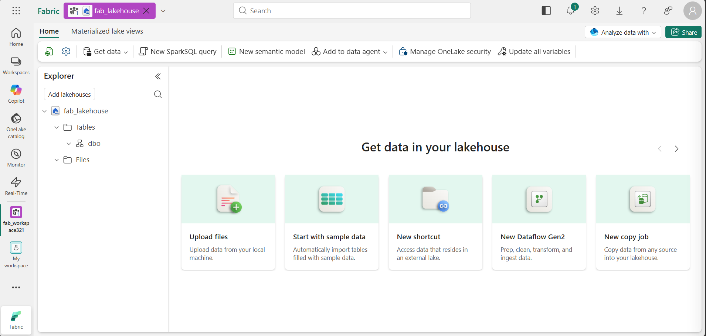
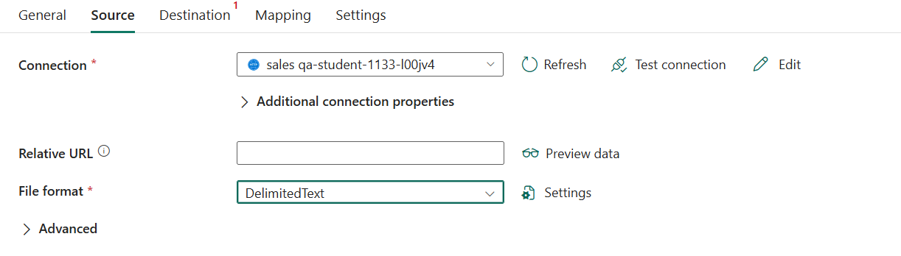
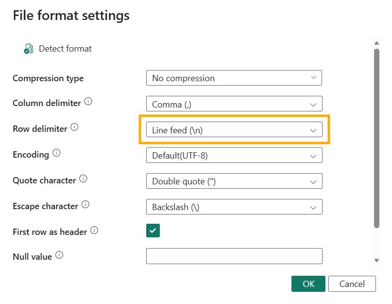
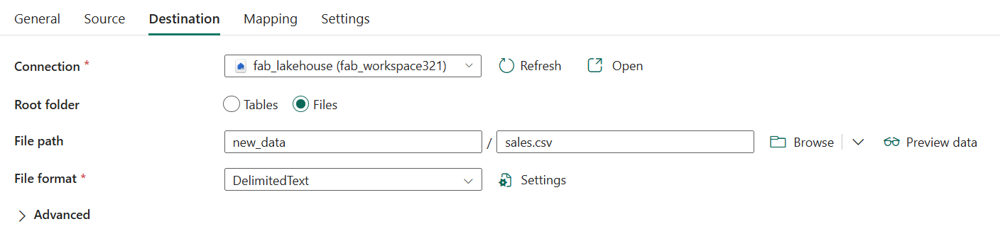
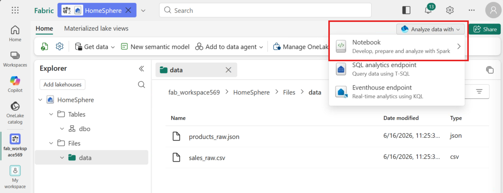
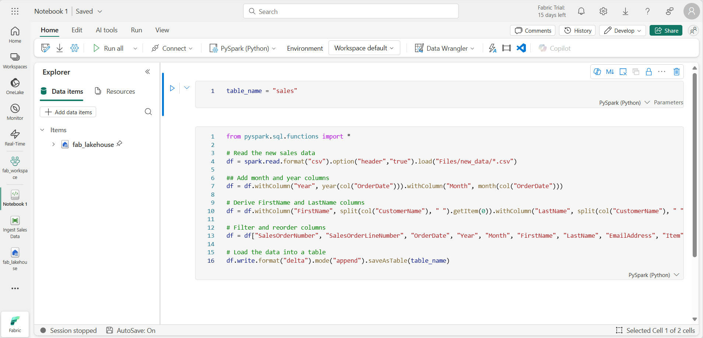
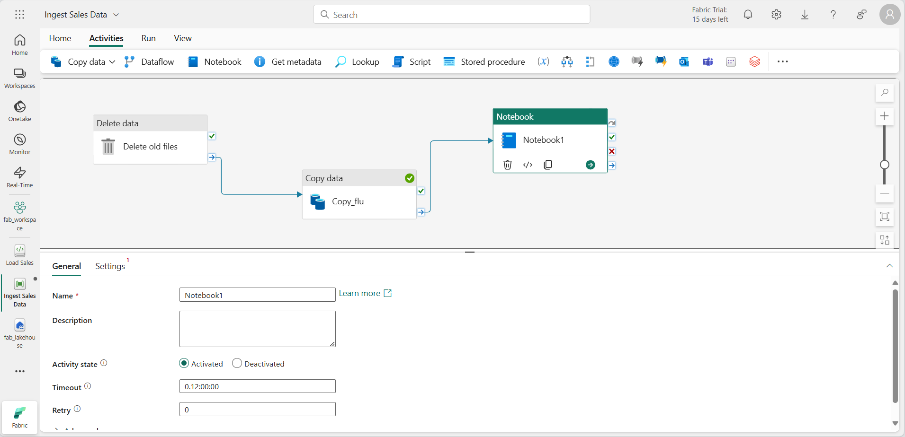
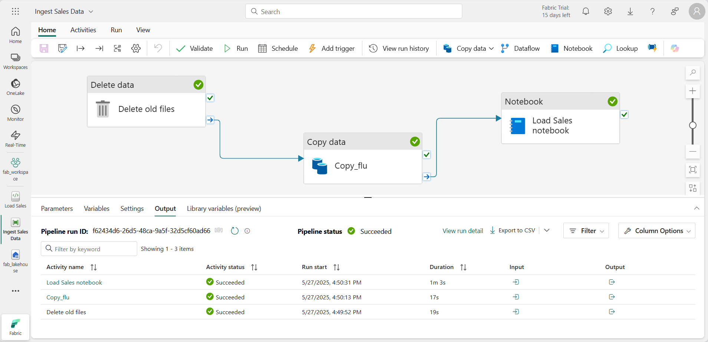

# Lab 04 ~ Ingest Data with a Pipeline in Microsoft Fabric

!!! info "For this lab, you will access the QA Platform and sign in using the credentials provided."

!!! warning "You must use an incognito or private browser window to avoid conflicts with any work or personal Microsoft accounts you may already be signed in to."


## Step 1: Create a workspace

Before working with data in Fabric, you need to create a workspace.

1. In the navigation pane on the left, select **Workspaces** (the icon looks similar to &#128455;).

2. Select **+ New workspace**, then create a workspace using the naming format below:

    - Start the name with `fab_workspace`
    - Add random numbers to make it unique (for example, `fab_workspace123`)
    - Leave all other options as the default values
    - Click **Apply**

3. When your new workspace opens, it should be empty:

    !!! quote ""
        

## Step 2: Create a lakehouse

Now that you have a workspace, it's time to create a data lakehouse into which you'll ingest data.

1. On the navigation pane on the left, select **Create**, and choose **Lakehouse**.
    - Give it a name of your choice. For example: `fab_lakehouse`
    - Make sure the "Lakehouse schemas" option is disabled.

    !!! tip "If the **Create** option is not pinned to the sidebar, you need to select the ellipsis (…) option first."

    After a minute or so, a new lakehouse with no **Tables** or **Files** will be created.

    !!! quote ""
        

2. On the **Explorer** pane on the left, in the **...** menu for the **Files** node, select **New subfolder**
    - Create a subfolder named: **new_data**

## Step 3: Create a pipeline

A simple way to ingest data is to use a **Copy Data** activity in a pipeline to extract the data from a source and copy it to a file in the lakehouse.

!!! note 
    A *Copy Job* and a *Copy Data* activity are different methods for moving data in Fabric. A Copy Job is a standalone, simplified data movement tool and doesn’t require a pipeline. A Copy Data activity is configured within a pipeline and supports orchestration with other activities. In this exercise, you use a **Copy Data** activity in a pipeline.

1. In the navigation pane on the left, select the name of your workspace.

2. In the workspace, select **New item**, search for **Pipeline**

3. Create a new pipeline named: `Ingest Sales Data`

4. In the pipeline editor canvas:
    - Select: **Pipeline activity**
    - Then select: **Copy Data**
    - A **Copy Data** activity is added to the pipeline canvas:

    !!! quote ""
        

### Configure the Source

1. Select the **Copy Data** activity on the canvas

2. Then in the pane below the canvas select the **Source** tab.

3. In the **Connection** drop-down, select **Browse all**.

4. In the **New connection** dialog, search for **HTTP** and select it, then select **Continue**.

5. Configure the following settings and then select **Connect**:

    - **URL**: https://raw.githubusercontent.com/MicrosoftLearning/dp-data/main/sales.csv
    - **Connection name**: sales
    - **Data gateway**: (none)
    - **Authentication kind**: Anonymous

6. Back on the **Source tab**, configure the following source settings:

    - **Relative URL**: *Leave blank*
    - **File format**: Select `DelimitedText` from the drop-down

    !!! quote ""
        

6. Select the **Settings** button next to the **File format** drop-down.

    In the **File format settings** dialog, ensure the following settings are configured and then select **OK**:

    - **Compression type**: No compression
    - **Column delimiter**: Comma (,)
    - **Row delimiter**: Line feed (\n)
    - **First row as header**: *Selected*

    !!! quote ""
        

    !!! tip "Make sure you select: **Line feed (\n)**"

7. Select **Test connection** to verify the connection works.

8. *Optional*: Select **Preview data** to confirm the data looks correct.

### Configure the Destination

1. Select the **Destination** tab. Then in the **Connection** drop-down, select **Browse all**.

2. In the **New connection** dialog box, find and select your lakehouse in the *OneLake Catalog* section.

3. After the connection is created, return to the **Destination** tab and configure the following settings:

    - **Connection**: *Your newly created lakehouse connection*
    - **Lakehouse**: *Select the lakehouse you created earlier*
    - **Root folder**: Files
    - **File path**: *Directory*: new_data / *File name*: sales.csv

    !!! quote ""
        

4. No other changes are necessary.

### Run the pipeline

1. On the **Home** tab, use the :material-content-save: (*Save*) icon to save the pipeline.

2. Then use the :material-play: **Run** button to run the pipeline.

3. When the pipeline starts to run, you can monitor its status in the **Output** pane under the pipeline designer.

    - Use the :material-refresh: (*Refresh*) icon to refresh the status, and wait until it has succeeded.

4. In the navigation pane on the left, select your lakehouse.

5. On the **Home** page, in the **Explorer** pane, expand **Files**

    - Select the **new_data** folder to verify that the **sales.csv** file has been copied.

    !!! quote ""
        

## Step 4: Create a notebook

!!! info "Notebooks are made up of one or more cells that can contain *code* or *markdown* (formatted text)."

1. On the **Home** tab of your lakehouse, select **Open notebook** > **New notebook**.

    At the top-right of the Lakehouse page:

    - Select **Analyze data with** dropdown and choose: **Notebook** > **New notebook**

    !!! quote ""
        

    After a few seconds, a new notebook containing a single *cell* will open. 

2. Select the existing cell in the notebook, which contains some simple code

    - Replace the default code with the following variable declaration.

    ```python
    table_name = "sales"
    ```

3. In the **...** menu for the cell (at its top-right) select **Toggle parameter cell**. 

    !!! info "Toggle parameter cell"
        This configures the cell so that the variables declared in it are treated as parameters when running the notebook from a pipeline.

4. Under the parameters cell, use the **+ Code** button to add a new code cell. Then add the following code to it:

    ```python
    from pyspark.sql.functions import *

    # Read the new sales data
    df = spark.read.format("csv").option("header","true").load("Files/new_data/*.csv")

    ## Add month and year columns
    df = df.withColumn("Year", year(col("OrderDate"))).withColumn("Month", month(col("OrderDate")))

    # Derive FirstName and LastName columns
    df = df.withColumn("FirstName", split(col("CustomerName"), " ").getItem(0)).withColumn("LastName", split(col("CustomerName"), " ").getItem(1))

    # Filter and reorder columns
    df = df["SalesOrderNumber", "SalesOrderLineNumber", "OrderDate", "Year", "Month", "FirstName", "LastName", "EmailAddress", "Item", "Quantity", "UnitPrice", "TaxAmount"]

    # Load the data into a table
    df.write.format("delta").mode("append").saveAsTable(table_name)
    ```

    This code loads the data from the sales.csv file that was ingested by the **Copy Data** activity, applies some transformation logic, and saves the transformed data as a table - appending the data if the table already exists.

5. Verify that your notebooks looks similar to this, and then use the :material-play: **Run all** button on the toolbar to run all of the cells it contains.

    !!! quote ""
        

    !!! note
        - Since this is the first time you've run any Spark code in this session, the Spark pool must be started.
        - This means that the first cell can take a minute or so to complete.

### Run completed

When the notebook run has completed:

1. In the **Explorer** pane on the left, in the **...** menu for **Tables** select **Refresh**

    - Verify that a **sales** table has been created.

2. In the notebook menu bar, use the ⚙️ **Settings** icon to view the notebook settings.

    - Then set the **Name** of the notebook to `Load Sales` and close the settings pane.

3. In the hub menu bar on the left, select your lakehouse.

4. In the **Explorer** pane, refresh the view. Then expand **Tables**, and select the **sales** table to see a preview of the data it contains.

    !!! warning "If the preview won't load you may need to first cancel the running notebook"
        - To do this click the **Monitor** tab and cancel any running activities

## Step 5: Modify the pipeline

Now that you've implemented a notebook to transform data and load it into a table, you can incorporate the notebook into a pipeline to create a reusable ETL process.

1. In the hub menu bar on the left select the **Ingest Sales Data** pipeline you created previously.

2. On the **Activities** tab, in the **All activities** list, select **Delete data**. Then position the new **Delete data** activity to the left of the **Copy data** activity and connect its **On completion** output to the **Copy data** activity, as shown here:

    !!! note "If you can't see the **All activities** option - click the 3 dots (**...**)"

    !!! quote ""
        

    !!! note "If you are unable to click the **Activity** tab - refreshing the page may help"

3. Select the **Delete data** activity, and in the pane below the design canvas, set the following properties:

    - **General**:
        - **Name**: `Delete old files`

    - **Source**:
        - **Connection**: Browse all, and select your lakehouse
        - **File path type**: Wildcard file path
        - **Folder path**: Files / **new_data**
        - **Wildcard file name**: `*.csv`
        - **Recursively**: Selected

    - **Logging settings**:
        - **Enable logging**: *<u>Un</u>selected*

    These settings will ensure that any existing .csv files are deleted before copying the **sales.csv** file.

4. In the pipeline designer, on the **Activities** tab, select **Notebook** to add a **Notebook** activity to the pipeline.

5. Select the **Copy data** activity and then connect its **On Completion** output to the **Notebook** activity as shown here:

    !!! quote ""
        

6. Select the **Notebook** activity, and then in the pane below the design canvas, set the following properties:

    - **General**:
        - **Name**: `Load Sales notebook`

    - **Settings**:
        - **Notebook**: Select your *Load Sales* notebook
        - **Base parameters**: *Add a new parameter with the following properties:*

        | Name       | Type   | Value     |
        |------------|--------|-----------|
        | table_name | String | new_sales |

    !!! info "Passing parameters into a notebook"
        - The **table_name** parameter will be passed to the notebook.
        - This will override the default value assigned to the **table_name** variable in the parameters cell.

7. On the **Home** tab, use the  :material-content-save: (*Save*) icon to save the pipeline.

8. Then use the :material-play: **Run** button to run the pipeline, and wait for all of the activities to complete.

    !!! quote ""
        

    !!! warning "If you see an error message"
        - In case you receive the error message:
            - *Spark SQL queries are only possible in the context of a lakehouse. Please attach a lakehouse to proceed:*
        - Open your notebook, select the lakehouse you created on the left pane,
        - select **Remove all Lakehouses** and then add it again.
        - Go back to the pipeline designer and select :material-play: **Run**.

9. In the hub menu bar on the left edge of the portal, select your lakehouse.

10. In the **Explorer** pane, expand **Tables** and select the **new_sales** table to see a preview of the data it contains. This table was created by the notebook when it was run by the pipeline.

In this exercise, you implemented a data ingestion solution that uses a pipeline to copy data to your lakehouse from an external source, and then uses a Spark notebook to transform the data and load it into a table.

---

## Clean up resources

Once you've finished exploring your pipeline, you should delete the workspace you created for this exercise.

1. Navigate to Microsoft Fabric in your browser.

2. In the bar on the left, select the icon for your workspace to view all of the items it contains.

3. Select **Workspace settings** and in the **General** section, scroll down and select **Remove this workspace**.

4. Select **Delete** to delete the workspace.

---
<small><b>Source:
https://microsoftlearning.github.io/mslearn-fabric/Instructions/Labs/04-ingest-pipeline.html
</b></small>

