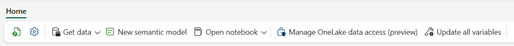
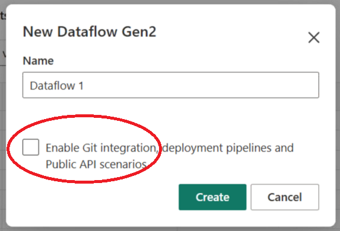
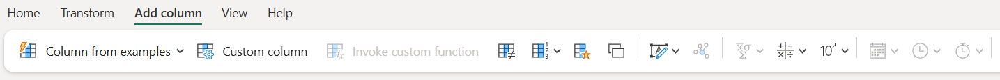
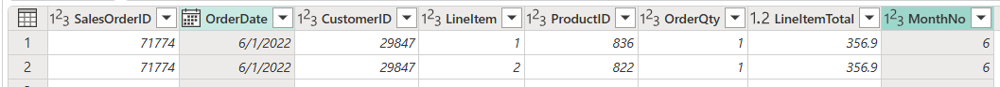
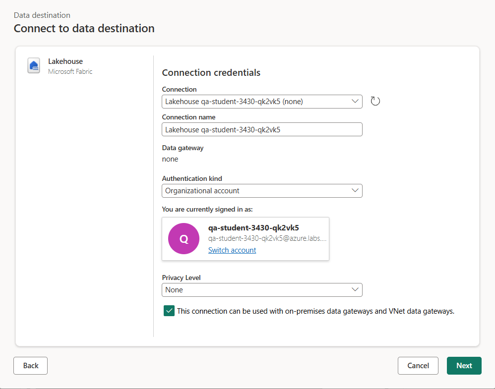
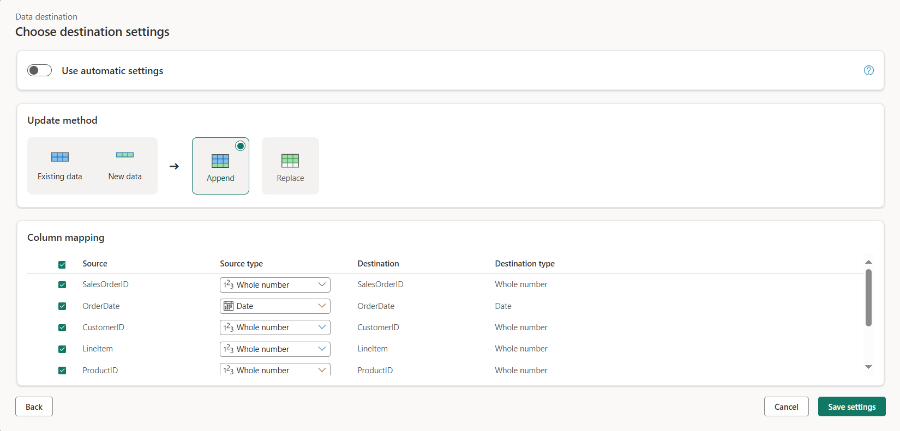
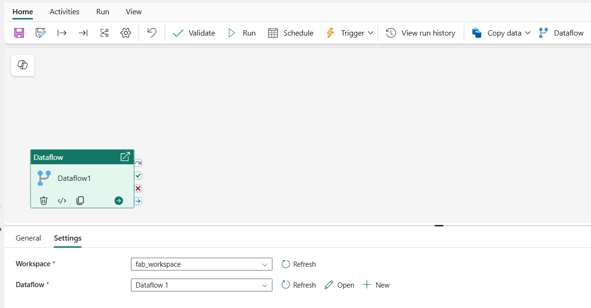
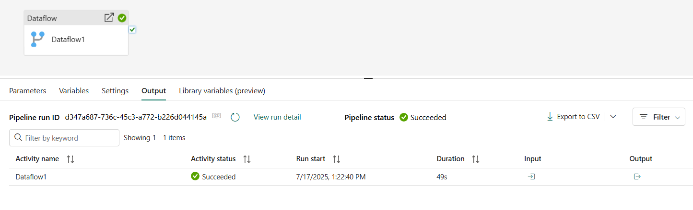
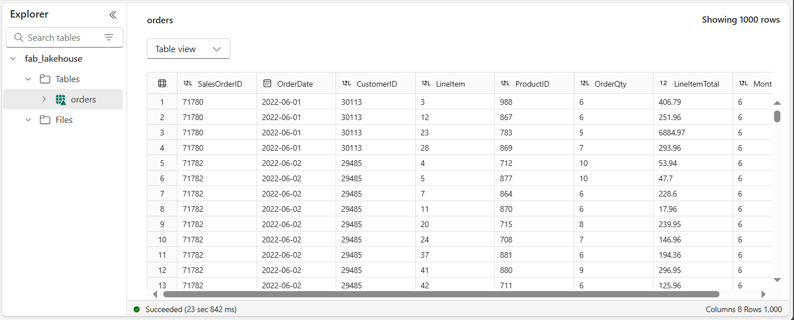

# Lab 05 ~ Create and use Dataflows (Gen2) in Microsoft Fabric

!!! info "For this lab you need to navigate to QA Platform and login using the credentials provided"

!!! warning "It is important that you use an incognito/private mode browser tab and not your work or personal Microsoft login"

## Step 1: Signing in to Microsoft Fabric

In this lab, you will sign in to Microsoft Fabric using the email and password from the QA Platform.

1. Using an **incognito/private mode browser tab** navigate to the [Fabric portal](https://app.fabric.microsoft.com/) at: https://fabric.microsoft.com

2. Follow the prompts, and sign in with the user credentials from the QA Platform:
    - Email
    - Password

3. After signing in, you will be redirected to the Fabric home page:

    !!! quote ""
        

## Step 2: Create a workspace

Before working with data in Fabric, you need to create a workspace with a Fabric licence capacity.

1. Navigate to the [Microsoft Fabric home page](https://app.fabric.microsoft.com/home?experience=fabric) in an incognito/private mode browser tab browser, and sign in with the Fabric credentials from the QA Platform.

2. In the menu bar on the left, select Workspaces (the icon looks similar to 🗇).

3. Create a **New workspace**:

    - Give it a unique name. For example: `fab_workspace123`
    - Leave all other options as the default values
    - Click **Apply**

4. When your new workspace opens, it should be empty.

    !!! quote ""
        

## Step 3: Create a lakehouse

Now that you have a workspace, it's time to create a data lakehouse into which you'll ingest data.

1. On the menu bar on the left, select **Create**. In the *New* page, under the *Data Engineering* section, select **Lakehouse**.
    - Give it a unique name of your choice. For example: `fab_lakehouse123`
    - Make sure the "Lakehouse schemas (Public Preview)" option is disabled.

    !!! tip "If the **Create** option is not pinned to the sidebar, you need to select the ellipsis (…) option first."

    After a minute or so, a new empty lakehouse will be created.

    !!! quote ""
        

2. View the new lakehouse, and note that the **Lakehouse explorer** pane on the left enables you to browse tables and files in the lakehouse:

    - The **Tables** folder contains tables that you can query using SQL semantics. Tables in a Microsoft Fabric lakehouse are based on the open source *Delta Lake* file format, commonly used in Apache Spark.

    - The **Files** folder contains data files in the OneLake storage for the lakehouse that aren't associated with managed delta tables. You can also create shortcuts in this folder to reference data that is stored externally.

Currently, there are no tables or files in this lakehouse.

## Step 4: Create a Dataflow (Gen2) to ingest data

Now that you have a lakehouse, you need to ingest some data into it. One way to do this is to define a dataflow that encapsulates an *extract, transform, and load* (ETL) process.

1. In the home page for your lakehouse, select **Get data > New Dataflow Gen2**

    !!! quote ""
        

    *Make sure that **Enable Git Integration** is NOT selected:*

    { width="300"}

    Click **Create**, and after a few seconds, the Power Query editor for your new dataflow opens as shown here:

    !!! quote ""
        

2. Select **Import from a Text/CSV file**, and create a new data source with the following settings:

    - **Link to file**: *Selected*
    - **File path or URL**: https://raw.githubusercontent.com/MicrosoftLearning/dp-data/main/orders.csv
    - **Connection**: Create new connection
    - **Connection Name**: *Specify a unique name*
    - **data gateway**: (none)
    - **Authentication kind**: Anonymous

3. Select **Next** to preview the file data, and then **Create** the data source.

    The Power Query editor shows the data source and an initial set of query steps to format the data, as shown here:

    !!! quote ""
        

## Step 5: Transform the data using Power Query

You can now transform the data. In this lab we will add a column using a custom formula.

1. On the toolbar ribbon, select the **Add column** tab. Then select **Custom column** and create a new column.

    !!! quote ""
        

2. Do the following:

    - Set the *New column name* to: **MonthNo**
    - Set the *Data type* to: **Whole number**
    - Add this *Custom column formula*: `Date.Month([OrderDate])`

    !!! quote ""
        

3. Click **OK** to create the column. Notice how the step to add the custom column is added to the query.

    The resulting column is displayed in the data pane:

    !!! quote ""
        

    !!! info
        - In the Query Settings pane on the right side, notice the **Applied Steps** include each transformation step.
        - At the bottom, you can also toggle the **Diagram view** button to turn on the Visual Diagram of the steps.

    !!! info
        Steps can be moved up or down, edited by selecting the gear icon, and you can select each step to see the transformations apply in the preview pane.

4. Check and confirm that the data type for the **OrderDate** column is set to **Date** and the data type for the newly created column **MonthNo** is set to **Whole Number**.

    !!! quote ""
        

## Step 6: Add data destination for Dataflow

The next step is to define a destination for your transformed data. This will be the lakehouse you created in Step 3.

1. On the toolbar ribbon, select the **Home** tab. Then in the **Query** section, choose **Add data destination**

    !!! quote ""
        

2. Select **Lakehouse**.

3. In the **Connect to data destination** dialog box, use the existing connection credentials:

    !!! quote ""
        { width="700" }

4. Select **Next** and in the list of available workspaces, find your workspace and select the lakehouse you created in it at the start of this exercise. 
    
    - Then specify a new table named **orders**:

    !!! quote ""
        

5. Select **Next** and on the **Choose destination settings** page:

    - Disable the **Use automatic settings** option
    - Select **Append**
    - Then click **Save settings**.

    !!! quote ""
        

6. On the Menu bar, open **View** and select **Diagram view**. Notice the **Lakehouse** destination is indicated as an icon in the query in the Power Query editor.

    !!! quote ""
        

7. On the toolbar ribbon, select the **Home** tab. Then select **Save & run** and wait for the **Dataflow 1** dataflow to be created in your workspace.

## Step 7: Add a dataflow to a pipeline

You can include a dataflow as an activity in a pipeline. Pipelines are used to orchestrate data ingestion and processing activities, enabling you to combine dataflows with other kinds of operation in a single, scheduled process. Pipelines can be created in a few different experiences, including Data Factory experience.

1. From your Fabric-enabled workspace, select **+ New item > Data pipeline**

    - When prompted, create a new pipeline named: **Load data**

    Click **Create**, and the pipeline editor will open:

    !!! quote ""
        

    !!! tip "If the Copy Data wizard opens automatically, you can just close it."

2. Select **Pipeline activity**, and add a **Dataflow** activity to the pipeline.

3. With the new **Dataflow1** activity selected, on the **Settings** tab, in the **Dataflow** drop-down list, select **Dataflow1** (the data flow you created previously)

    !!! quote ""
        

4. On the **Home** tab, save the pipeline using the :material-content-save: (Save) icon.

5. Use the :material-play: **Run** button to run the pipeline, and wait for it to complete. It may take a few minutes.

    !!! quote ""
        

6. In the menu bar on the left edge, select your lakehouse.

7. In the **...** menu for **Tables**, select **refresh**. 

    Then expand **Tables** and select the **orders** table, which has been created by your dataflow.

    !!! quote ""
        

??? tip "Tip for Power Bi Desktop users:"
    - In Power BI Desktop, you can connect directly to the data transformations done with your dataflow by using the Power BI dataflows (Legacy) connector.
    - You can also make additional transformations, publish as a new dataset, and distribute with intended audience for specialised datasets.

    !!! quote ""
        { width="350" }

---

## Clean up resources

Once you've finished exploring dataflows in Microsoft Fabric, you should delete the workspace you created for this exercise.

1. Navigate to Microsoft Fabric in your browser.

2. In the bar on the left, select the icon for your workspace to view all of the items it contains.

3. Select **Workspace settings** and in the **General** section, scroll down and select **Remove this workspace**.

4. Select **Delete** to delete the workspace.

---
<small><b>Source:
https://microsoftlearning.github.io/mslearn-fabric/Instructions/Labs/05-dataflows-gen2.html
</b></small>

