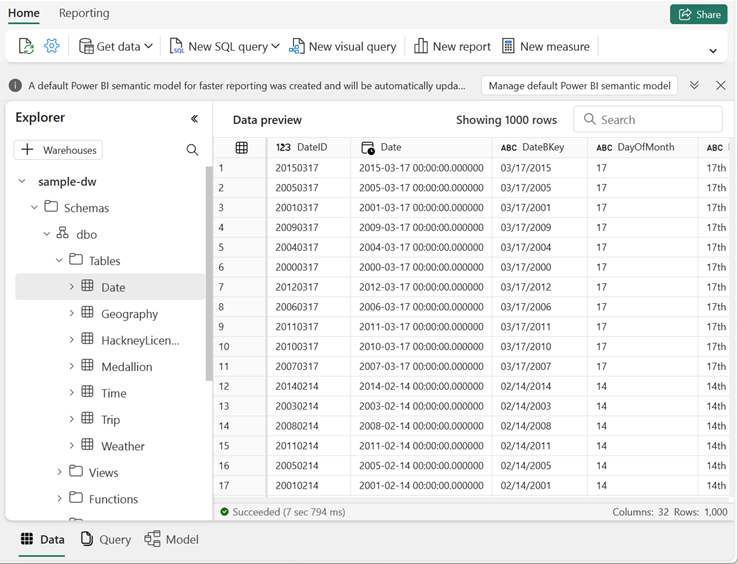

# Lab 06c ~ Monitor a data warehouse in Microsoft Fabric

!!! info "For this lab you need to navigate to QA Platform and login using the credentials provided"

!!! warning "It is important that you use an incognito/private mode browser tab and not your work or personal Microsoft login"


## Step 1: Signing in to Microsoft Fabric

In this lab, you will sign in to Microsoft Fabric using the email and password from the QA Platform.

1. Using an **incognito/private mode browser tab** navigate to the [Fabric portal](https://app.fabric.microsoft.com/) at: https://fabric.microsoft.com

2. Follow the prompts, and sign in with the user credentials from the QA Platform:
    - Email
    - Password

3. After signing in, you will be redirected to the Fabric home page:

    !!! quote ""
        


## Step 2: Create a workspace

Before working with data in Fabric, you need to create a workspace with a Fabric licence capacity.

1. Navigate to the [Microsoft Fabric home page](https://app.fabric.microsoft.com/home?experience=fabric) in an incognito/private mode browser tab browser, and sign in with the Fabric credentials from the QA Platform.

2. In the menu bar on the left, select Workspaces (the icon looks similar to 🗇).

3. Create a **New workspace**:

    - Give it a unique name. For example: `fab_workspace123`
    - Leave all other options as the default values
    - Click **Apply**

4. When your new workspace opens, it should be empty.

    !!! quote ""
        


## Step 3: Create a sample data warehouse

Now that you have a workspace, it's time to create a data warehouse.

1. On the menu bar on the left, select **Create**. In the *New* page, under the *Data Warehouse* section, select **Sample warehouse** and create a new data warehouse named `sample-dw`

    !!! note "If the Create option is not pinned to the sidebar, you need to select the ellipsis (…) option first."

    After a minute or so, a new warehouse will be created and populated with sample data for a taxi ride analysis scenario.

    !!! quote ""
        


## Step 4: Explore dynamic management views

Microsoft Fabric data warehouses include *dynamic management views* (DMVs), which you can use to identify current activity in the data warehouse instance.

1. In the **sample-dw** data warehouse page, in the **New SQL query** drop-down list, select **New SQL query**.

2. In the new blank query pane, enter the following Transact-SQL code to query the **sys.dm_exec_connections** DMV:

    ```sql
    SELECT * FROM sys.dm_exec_connections;
    ```

3. Use the :material-play: **Run** button to run the SQL script and view the results, which include details of all connections to the data warehouse.

4. Modify the SQL code to query the **sys.dm_exec_sessions** DMV, like this:

    ```sql
    SELECT * FROM sys.dm_exec_sessions;
    ```

5. Run the modified query and view the results, which show details of all authenticated sessions.

6. Modify the SQL code to query the **sys.dm_exec_requests** DMV, like this:

    ```sql
    SELECT * FROM sys.dm_exec_requests;
    ```

7. Run the modified query and view the results, which show details of all requests being executed in the data warehouse.

8. Modify the SQL code to join the DMVs and return information about currently running requests in the same database, like this:

    ```sql
    SELECT connections.connection_id,
           sessions.session_id, sessions.login_name, sessions.login_time,
           requests.command, requests.start_time, requests.total_elapsed_time
    FROM sys.dm_exec_connections AS connections
    INNER JOIN sys.dm_exec_sessions AS sessions
    ON connections.session_id=sessions.session_id
    INNER JOIN sys.dm_exec_requests AS requests
    ON requests.session_id = sessions.session_id
    WHERE requests.status = 'running'
    AND requests.database_id = DB_ID()
    ORDER BY requests.total_elapsed_time DESC;
    ```

9. Run the modified query and view the results, which show details of all running queries in the database (including this one).

10. In the **New SQL query** drop-down list, select **New SQL query** to add a second query tab. Then in the new empty query tab, run the following code:

    ```sql
    WHILE 1 = 1
        SELECT * FROM Trip;
    ```

    !!! question "What does this code do: `WHILE 1 = 1`?"

11. Leave the query running, and return to the tab containing the code to query the DMVs and re-run it. This time, the results should include the second query that is running in the other tab.
    - Note the elapsed time for that query.

12. Wait a few seconds and re-run the code to query the DMVs again.
    - The elapsed time for the query in the other tab should have increased.

13. Return to the second query tab where the query is still running
    - Select **Cancel** to cancel it.

14. Back on the tab with the code to query the DMVs, re-run the query to confirm that the second query is no longer running.

15. Close all query tabs.

!!! info "Further Information"
    See [Monitor connections, sessions, and requests using DMVs](https://learn.microsoft.com/fabric/data-warehouse/monitor-using-dmv) in the Microsoft Fabric documentation for more information about using DMVs.


## Step 5: Explore query insights

Microsoft Fabric data warehouses provide *query insights* - a special set of views that provide details about the queries being run in your data warehouse.

!!! note "Initially you may see no data, this is because it takes a couple of minutes for query insights to populate."

1. In the **sample-dw** data warehouse page, in the **New SQL query** drop-down list, select **New SQL query**.

2. In the new blank query pane, enter the following Transact-SQL code to query the **exec_requests_history** view:

    ```sql
    SELECT * FROM queryinsights.exec_requests_history;
    ```

3. Use the :material-play: **Run** button to run the SQL script and view the results, which include details of previously executed queries.

4. Modify the SQL code to query the **frequently_run_queries** view, like this:

    ```sql
    SELECT * FROM queryinsights.frequently_run_queries;
    ```

5. Run the modified query and view the results, which show details of frequently run queries.

6. Modify the SQL code to query the **long_running_queries** view, like this:

    ```sql
    SELECT * FROM queryinsights.long_running_queries;
    ```

7. Run the modified query and view the results, which show details of all queries and their durations.

!!! info "Further Information"
    See [Query insights in Fabric data warehousing](https://learn.microsoft.com/fabric/data-warehouse/query-insights) in the Microsoft Fabric documentation for more information about using query insights.

---

## Clean up resources

In this exercise, you have used dynamic management views and query insights to monitor activity in a Microsoft Fabric data warehouse.

If you've finished exploring your data warehouse, you can delete the workspace you created for this exercise.

1. Navigate to Microsoft Fabric in your browser.

2. In the bar on the left, select the icon for your workspace to view all of the items it contains.

3. Select **Workspace settings** and in the **General** section, scroll down and select **Remove this workspace**.

4. Select **Delete** to delete the workspace.

---
<small><b>Source:
https://microsoftlearning.github.io/mslearn-fabric/Instructions/Labs/06c-monitor-data-warehouse.html
</b></small>

