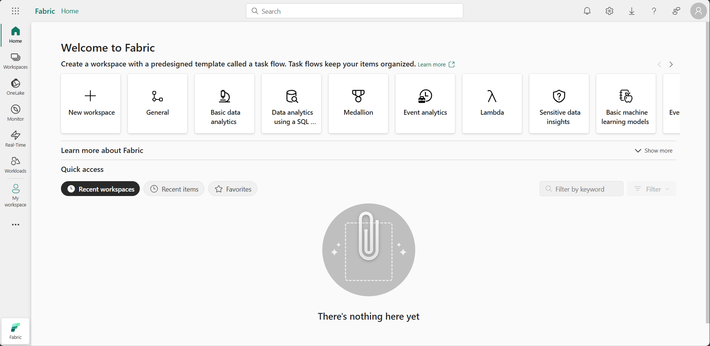
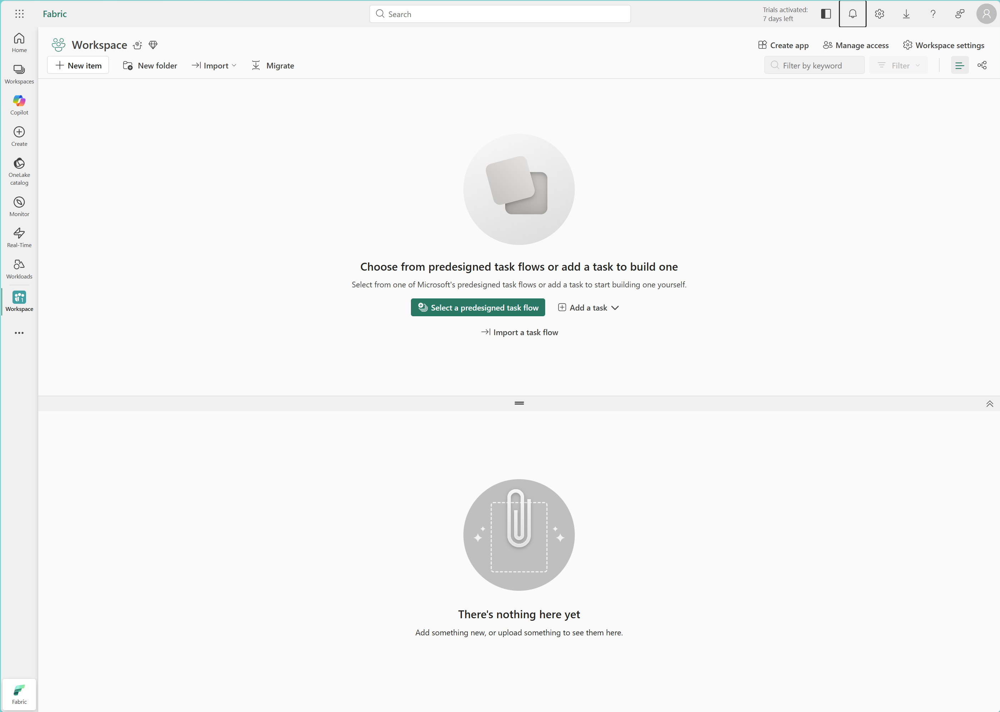
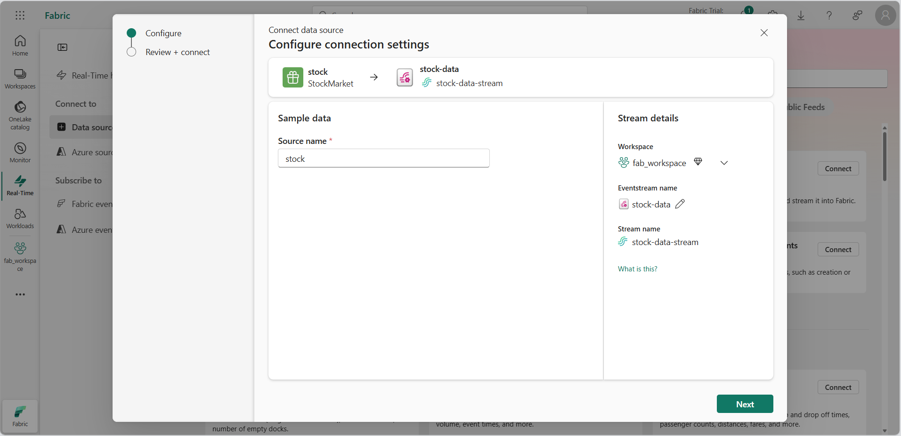
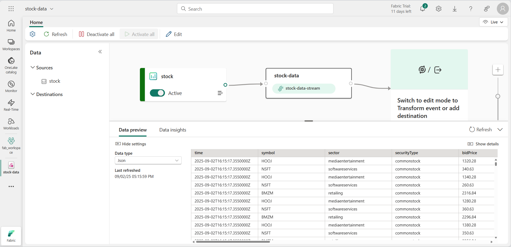
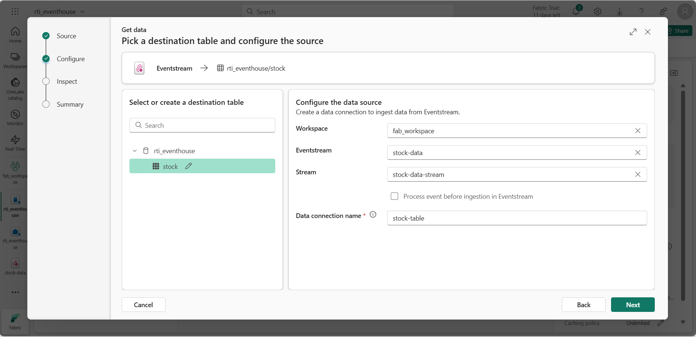
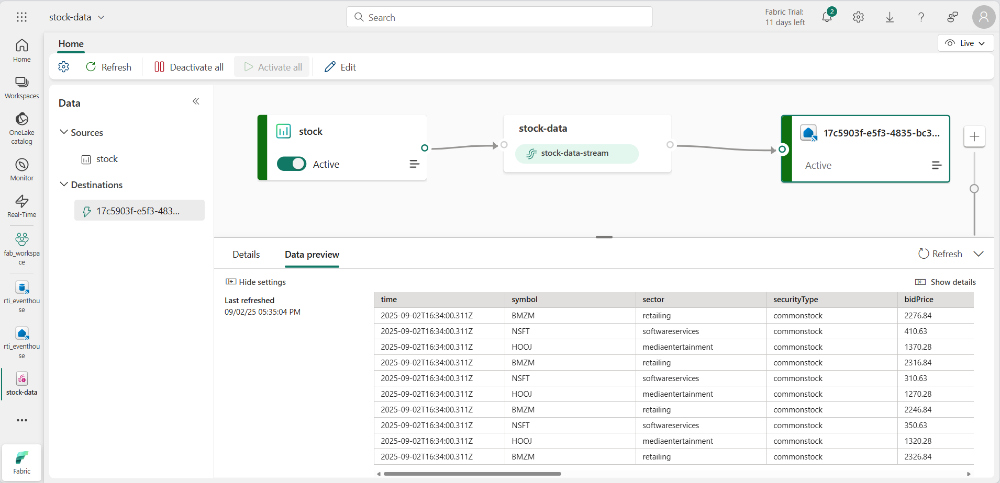
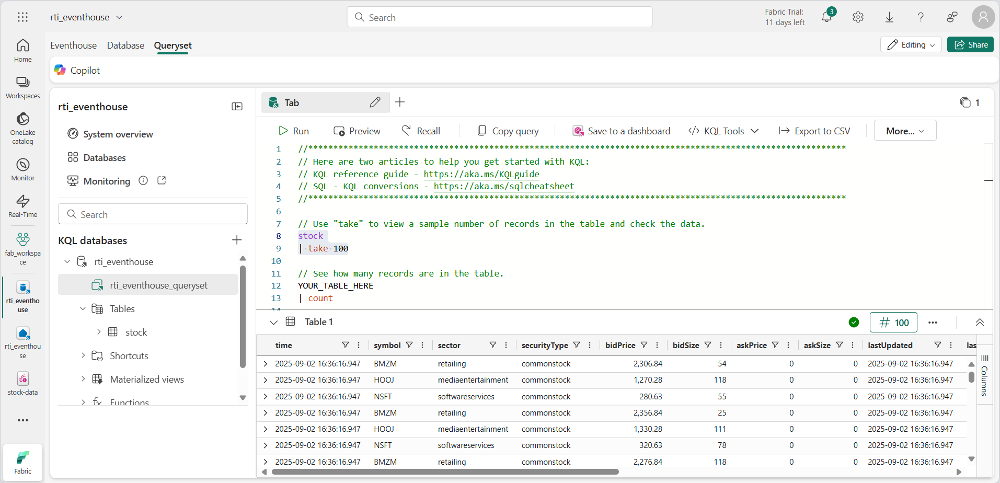
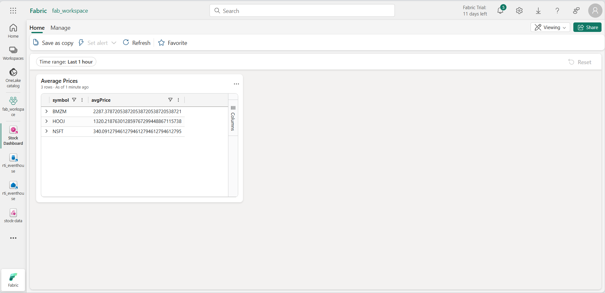
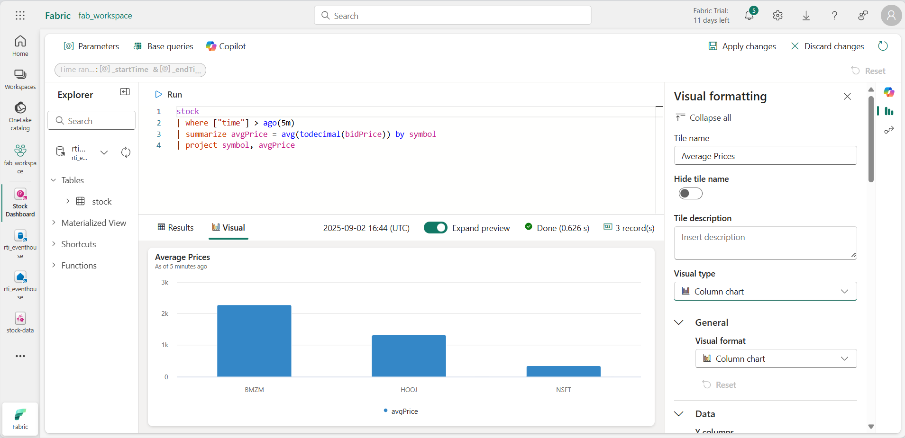
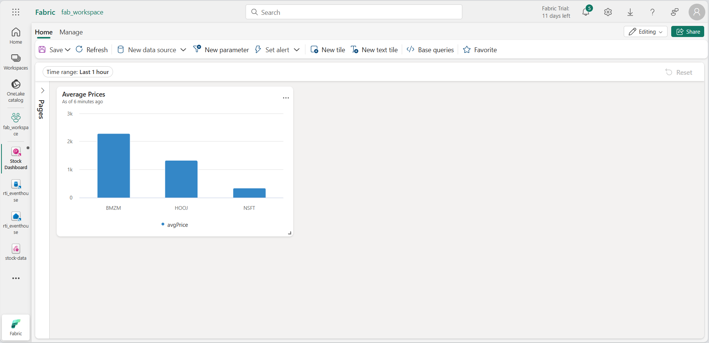

# Lab 07 ~ Real-Time Intelligence in MS Fabric

!!! info "For this lab, you will access the QA Platform and sign in using the credentials provided."

!!! warning "You must use an incognito or private browser window to avoid conflicts with any work or personal Microsoft accounts you may already be signed in to."


## Step 1: Access Microsoft Fabric

In this lab, you will access Microsoft Fabric using a temporary lab account provided by the QA Platform.

!!! note
    The QA Platform opens the Azure portal by default. This is expected. Microsoft Fabric is a separate portal, even though it uses the same Microsoft account.

1. In the QA Platform, wait until the lab status shows **Ready**.

2. Then right-click **Open** and choose **Open in a private browsing window** (InPrivate in Edge, Incognito in Chrome).

3. When prompted, sign in using:

    - **Username** from the QA Platform (used as the email address)
    - **Password** from the QA Platform (used as a Temporary Access Pass)

    - If prompted to "Stay signed in?", select **No**. This ensures the session ends when the private window is closed.

    !!! success "You are now signed in to the **Azure portal**. This confirms your lab account is active."

4. In the same private browsing window, **open a new tab**.

5. Navigate to the [Microsoft Fabric home page](https://app.fabric.microsoft.com) at: https://app.fabric.microsoft.com

6. If prompted, **re-enter your email address** to confirm access to Microsoft Fabric. This check verifies that a Fabric licence has been assigned to your lab account.

7. After confirmation, you should be be redirected to the **Microsoft Fabric home page**:

    !!! quote ""
        


## Step 2: Create a workspace

Before working with data in Fabric, you need to create a workspace.

1. In the left-hand navigation, select **Workspaces** (the icon looks similar to 🗇).

3. Select **+ New workspace**, then create a workspace using the naming format below:

    - Start the name with `fab_workspace`
    - Add random numbers to make it unique (for example, `fab_workspace123`)
    - Leave all other options as the default values
    - Click **Apply**

4. When your new workspace opens, it should be empty:

    !!! quote ""
        


## Step 3: Create an eventstream

Now you're ready to find and ingest real-time data from a streaming source. To do this, you'll start in the Fabric Real-Time Hub. The real-time hub provides an easy way to find and manage sources of streaming data.

> **Tip**: The first time you use the Real-Time Hub, some *Getting started* tips may be displayed. You can close these.

1. In the menu bar on the left, select the **Real-Time** hub.

    !!! note
        If you don't see the **Real-Time hub**, select the ellipsis **(...)** and then pin the Real-Time hub to the menu bar.

    !!! quote ""
        

2. In the **Real-Time hub**, select **Add data**.

    !!! quote ""
        

3. Select the **Stock market** sample data source.

4. Configure the data source as follows:
    - **Source name**: `stock`
    - **Workspace**: Select the workspace you created
    - **Eventstream name**: `stock-data`

    !!! info "The default stream associated with this data will automatically be named `stock-data-stream`"

    !!! quote ""
        

5. Select **Next**, then **Connect** to create the eventstream. 

6. Select **Open eventstream**. The eventstream will show the **stock** source and the **stock-data-stream** on the design canvas:

    !!! quote ""
        


## Step 4: Create an eventhouse

The eventstream ingests the real-time stock data, but doesn't currently do anything with it. Let's create an eventhouse where we can store the captured data in a table.

1. On the menu bar on the left, select **Create**. In the *New* page, under the *Real-Time Intelligence* section, select **Eventhouse**. Give it a unique name of your choice.

    !!! note "If the **Create** option is not pinned to the sidebar, you need to select the ellipsis (**...**) option first."

    Close any tips or prompts that are displayed until you see your new empty eventhouse.

    !!! quote ""
        

2. In the pane on the left, note that your eventhouse contains a KQL database with the same name as the eventhouse. You can create tables for your real-time data in this database, or create additional databases as necessary.

3. Select the database, and note that there is an associated *queryset*. This file contains some sample KQL queries that you can use to get started querying the tables in your database.

    However, currently there are no tables to query. Let's resolve that problem by getting data from the eventstream into a new table.

4. In the main page of your KQL database, select **Get data**.

5. For the data source, select **Eventstream** > **Existing eventstream**.

6. In the **Select or create a destination table** pane, create a new table named `stock`. Then in the **Configure the data source** pane, select your workspace and the **stock-data** eventstream and name the connection `stock-table`.

    !!! quote ""
        

7. Use the **Next** button to complete the steps to inspect the data and then finish the configuration. Then close the configuration window to see your eventhouse with the stock table.

    !!! quote ""
        

    The connection between the stream and the table has been created. Let's verify that in the eventstream.

8. In the menu bar on the left, select the **Real-Time** hub. In the **...** menu for the **stock-data-stream** stream, select **Open eventstream**.

    The eventstream now shows a destination for the stream:

    !!! quote ""
        

    !!! tip "Select the destination on the design canvas, and if no data preview is shown beneath it, select **Refresh**."

    In this exercise, you've created a very simple eventstream that captures real-time data and loads it into a table. In a real solution, you'd typically add transformations to aggregate the data over temporal windows (for example, to capture the average price of each stock over five-minute periods).

    Now let's explore how you can query and analyze the captured data.


## Step 5: Query the captured data

The eventstream captures real-time stock market data and loads it into a table in your KQL database. You can query this table to see the captured data.

1. In the menu bar on the left, select your eventhouse database.

2. Select the *queryset* for your database.

3. In the query pane, modify the first example query as shown here:

    ```kql
    stock
    | take 100
    ```

4. Select the query code and run it to see 100 rows of data from the table.

    !!! quote ""
        

5. Review the results, then modify the query to retrieve the average price for each stock symbol in the last 5 minutes:

    ```kql
    stock
    | where ["time"] > ago(5m)
    | summarize avgPrice = avg(todecimal(bidPrice)) by symbol
    | project symbol, avgPrice
    ```

6. Highlight the modified query and run it to see the results.

7. Wait a few seconds and run it again, noting that the average prices change as new data is added to the table from the real-time stream.


## Step 6: Create a real-time dashboard

Now that you have a table that is being populated by stream of data, you can use a real-time dashboard to visualize the data.

1. In the query editor, select the KQL query you used to retrieve the average stock prices for the last five minutes.

2. On the toolbar, select **Save to dashboard**. Then pin the query **in a new dashboard** with the following settings:
    - **Dashboard name**: `Stock Dashboard`
    - **Tile name**: `Average Prices`

3. Create the dashboard and open it. It should look like this:

    !!! quote ""
        

4. At the top-right of the dashboard, switch from **Viewing** mode to **Editing** mode.

5. Select the **Edit** (*pencil*) icon for the **Average Prices** tile.

6. In the **Visual formatting** pane, change the **Visual** from *Table* to *Column chart*:

    !!! quote ""
        

7. At the top of the dashboard, select **Apply changes** and view your modified dashboard:

    !!! quote ""
        

    Now you have a live visualization of your real-time stock data.


## Step 7: Create an alert

Real-Time Intelligence in Microsoft Fabric includes a technology named *Activator*, which can trigger actions based on real-time events. Let's use it to alert you when the average stock price increases by a specific amount.

1. In the dashboard window containing your stock price visualization, in the toolbar, select **Set alert**.

2. In the **Set alert** pane, create an alert with the following settings:

    - **Run query every**: 5 minutes
    - **Check**: On each event grouped by
    - **Grouping field**: symbol
    - **When**: avgPrice
    - **Condition**: Increases by
    - **Value**: 100
    - **Action**: Send me an email
    - **Save location**:
        - **Workspace**: *Your workspace*
        - **Item**: Create a new item
        - **New item name**: *A unique name of your choice*

    !!! quote ""
        

3. Create the alert and wait for it to be saved. Then close the pane confirming it has been created.

4. In the menu bar on the left, select the page for your workspace (saving any unsaved changes to your dashboard if prompted).

5. On the workspace page, view the items you have created in this exercise, including the activator for your alert.

6. Open the activator, and in its page, under the **avgPrice** node, select the unique identifier for your alert. Then view its **History** tab.

    Your alert may not have been triggered, in which case the history will contain no data. If the average stock price ever changes by more than 100, the activator will send you an email and the alert will be recorded in the history.

---

## Clean up resources

In this exercise, you have create an eventhouse, ingested real-time data using an eventstream, queried the ingested data in a KQL database table, created a real-time dashboard to visualize the real-time data, and configured an alert using Activator.

Once you've finished exploring your lakehouse, you should delete the workspace you created for this exercise.

1. Navigate to Microsoft Fabric in your browser.

2. In the bar on the left, select the icon for your workspace to view all of the items it contains.

3. Select **Workspace settings** and in the **General** section, scroll down and select **Remove this workspace**.

4. Select **Delete** to delete the workspace.

---
<small><b>Source:
https://microsoftlearning.github.io/mslearn-fabric/Instructions/Labs/07-real-time-Intelligence.html
</b></small>
