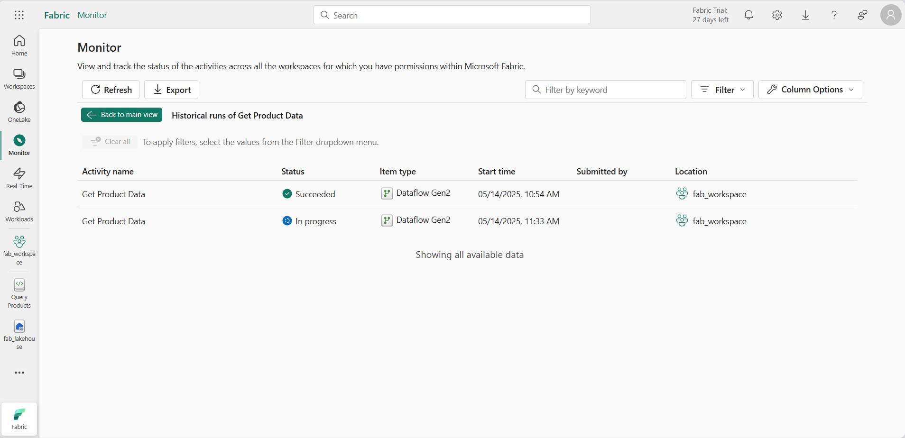

# Lab 18 ~ Monitor Fabric Activity in the Monitoring Hub

!!! info "For this lab, you will access the QA Platform and sign in using the credentials provided."

!!! warning "You must use an incognito or private browser window to avoid conflicts with any work or personal Microsoft accounts you may already be signed in to."

## Step 1: Access Microsoft Fabric

In this lab, you will access Microsoft Fabric using a temporary lab account provided by the QA Platform.

!!! note
    The QA Platform opens the Azure portal by default. This is expected. Microsoft Fabric is a separate portal, even though it uses the same Microsoft account.

1. In the QA Platform, wait until the lab status shows **Ready**.

2. Then right-click **Open** and choose **Open in a private browsing window** (InPrivate in Edge, Incognito in Chrome).

3. When prompted, sign in using:

    - **Username** from the QA Platform (used as the email address)
    - **Password** from the QA Platform (used as a Temporary Access Pass)

    - If prompted to "Stay signed in?", select **No**. This ensures the session ends when the private window is closed.

    !!! success "You are now signed in to the **Azure portal**. This confirms your lab account is active."

4. In the same private browsing window, **open a new tab**.

5. Navigate to the [Microsoft Fabric home page](https://app.fabric.microsoft.com) at: https://app.fabric.microsoft.com

6. If prompted, **re-enter your email address** to confirm access to Microsoft Fabric. This check verifies that a Fabric licence has been assigned to your lab account.

7. After confirmation, you should be be redirected to the **Microsoft Fabric home page**:

    !!! quote ""
        

## Step 2: Create a workspace

Before working with data in Fabric, you need to create a workspace.

1. In the left-hand navigation, select **Workspaces** (the icon looks similar to 🗇).

3. Select **+ New workspace**, then create a workspace using the naming format below:

    - Start the name with `fab_workspace`
    - Add random numbers to make it unique (for example, `fab_workspace123`)
    - Leave all other options as the default values
    - Click **Apply**

4. When your new workspace opens, it should be empty:

    !!! quote ""
        

## Step 3: Create a lakehouse

Now that you have a workspace, it's time to create a data lakehouse into which you'll ingest data.

1. On the menu bar on the left, select **Create**. In the New page, under the *Data Engineering* section, select **Lakehouse**.
    - Give it a unique name of your choice. For example: `fab_lakehouse`
    - Make sure the "Lakehouse schemas" option is disabled.

    !!! tip "If the **Create** option is not pinned to the sidebar, you need to select the ellipsis (…) option first."

    After a minute or so, a new empty lakehouse will be created.

    !!! quote ""
        

2. View the new lakehouse, and note that the **Lakehouse explorer** pane on the left enables you to browse tables and files in the lakehouse:

    - The **Tables** folder contains tables that you can query using SQL semantics. Tables in a Microsoft Fabric lakehouse are based on the open source *Delta Lake* file format, commonly used in Apache Spark.

    - The **Files** folder contains data files in the OneLake storage for the lakehouse that aren't associated with managed delta tables. You can also create shortcuts in this folder to reference data that is stored externally.

Currently, there are no tables or files in this lakehouse.

## Step 4: Create and monitor a Dataflow

In Microsoft Fabric, you can use a Dataflow (Gen2) to ingest data from a wide range of sources. In this exercise, you'll use a dataflow to get data from a CSV file and load it into a table in your lakehouse.

1. On the **Home** page for your lakehouse, in the **Get data** menu, select **New Dataflow Gen2**.

    *Make sure that **Enable Git Integration** is NOT selected:*

    { width="300"}

2. Name the new dataflow: `Get Product Data`
    - Select **Create**

    !!! quote ""
        

3. In the dataflow designer, select **Import from a Text/CSV file**. Then complete the Get Data wizard to create a data connection by linking to `https://raw.githubusercontent.com/MicrosoftLearning/dp-data/main/products.csv` using anonymous authentication.

    When you have completed the wizard, a preview of the data will be shown in the dataflow designer like this:

    !!! quote ""
        

4. Publish the dataflow.

5. In the navigation bar on the left, select **Monitor** to view the monitoring hub and observe that your dataflow is in-progress
    - If you can't see it, refresh the view until you see it in progress.

    !!! quote ""
        

6. Wait for a few seconds, and then refresh the page until the status of the dataflow is **Succeeded**.

7. In the navigation pane, select your lakehouse.

    - Then expand the **Tables** folder to verify that a table named **products** has been created and loaded by the dataflow.
    - If you can't see it, you may need to refresh the **Tables** folder.

    !!! quote ""
        

## Step 5: Create and monitor a Spark notebook

In Microsoft Fabric, you can use notebooks to run Spark code.

1. On the menu bar on the left, select **Create**. In the New page, under the Data Engineering section, select **Notebook**.

    A new notebook named **Notebook 1** is created and opened.

    !!! quote ""
        

2. At the top left of the notebook, select **Notebook 1** to view its details
    - Change its name to: `Query Products`

3. In the notebook editor, in the **Explorer** pane, select **Add data items** and then select **Existing data sources**.

4. Add the lakehouse you created previously.

5. Expand the lakehouse item until you reach the **products** table.

6. In the **...** menu for the **products** table, select **Load data > Spark**. This adds a new code cell to the notebook as shown here:

    !!! quote ""
        

7. Use the :material-play: **Run all** button to run all cells in the notebook. It will take a moment or so to start the Spark session, and then the results of the query will be shown under the code cell.

    !!! quote ""
        

8. On the toolbar, use the  :material-stop: (*Stop session*) button to stop the Spark session.

9. In the navigation bar, select **Monitor** to view the monitoring hub, and note that the notebook activity is listed.

    !!! quote ""
        

## Step 6: Monitor history for an item

Some items in a workspace might be run multiple times. You can use the monitoring hub to view their run history.

1. In the navigation bar, return to the page for your workspace. Then use the :material-refresh: (**Refresh now**) button for your **Get Product Data** dataflow to re-run it.

2. In the navigation pane, select the **Monitor** page to view the monitoring hub and verify that the dataflow is in-progress.

3. In the **...** menu for the **Get Product Data** dataflow, select **Historical runs** to view the run history for the dataflow:

    !!! quote ""
        

4. In the **...** menu for any of the historical runs select **View detail** to see details of the run.

5. Close the **Details** pane and use the **Back to main view** button to return to the main monitoring hub page.

## Step 7: Customise monitoring hub views

In this exercise you've only run a few activities, so it should be fairly easy to find events in the monitoring hub. However, in a real environment you may need to search through a large number of events. Using filters and other view customisations can make this easier.

1. In the monitoring hub, use the **Filter** button to apply the following filter:

    - **Status**: Succeeeded
    - **Item type**: Dataflow Gen2

    With the filter applied, only successful runs of dataflows are listed.

    !!! quote ""
        

2. Use the **Column Options** button to include the following columns in the view (use the **Apply** button to apply the changes):

    - Activity name
    - Status
    - Item type
    - Start time
    - Submitted by
    - Location
    - End time
    - Duration
    - Refresh type

    You may need to scroll horizontally to see all of the columns:

    !!! quote ""
        

---

## Clean up resources

In this exercise, you have created a lakehouse, a dataflow, and a Spark notebook; and you've used the monitoring hub to view item activity.

Once you've finished exploring your lakehouse, you should delete the workspace you created for this exercise.

1. Navigate to Microsoft Fabric in your browser.

2. In the bar on the left, select the icon for your workspace to view all of the items it contains.

3. Select **Workspace settings** and in the **General** section, scroll down and select **Remove this workspace**.

4. Select **Delete** to delete the workspace.

---
<small><b>Source:
https://microsoftlearning.github.io/mslearn-fabric/Instructions/Labs/18-monitor-hub.html
</b></small>
