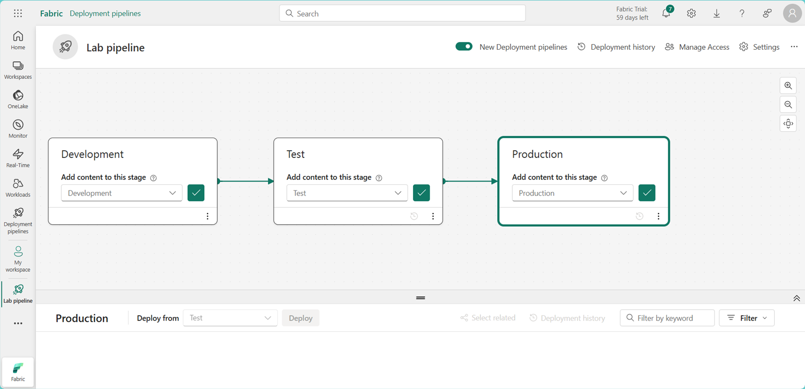
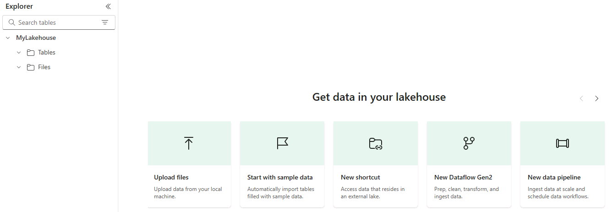
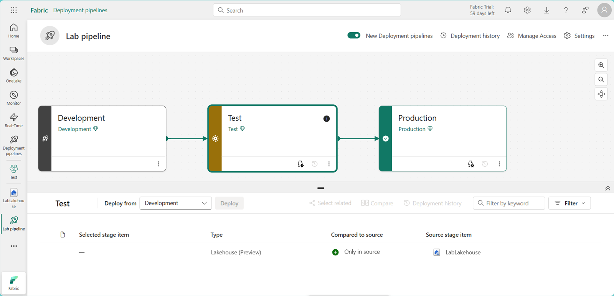
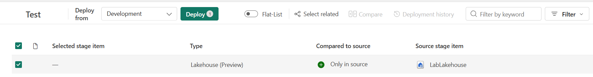
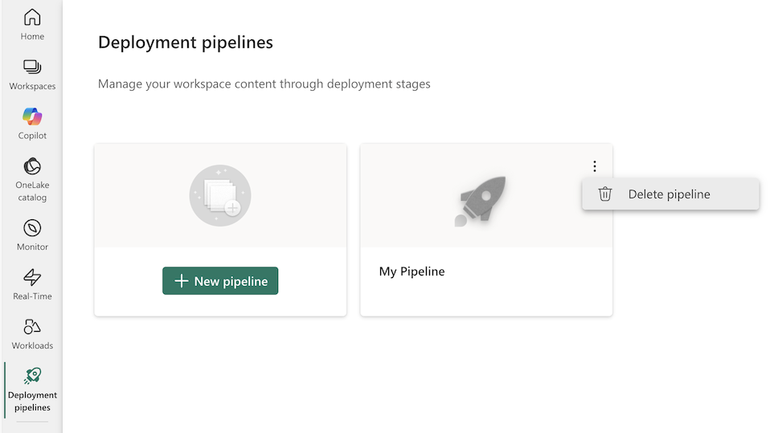

# Lab 21 ~ Implement deployment pipelines in Microsoft Fabric

## Step 1: Create workspaces

For this lab you need to create three workspaces: **Development**, **Test**, and **Production**.

1. In the navigation pane on the left, select **Workspaces** (the icon looks similar to &#128455;).

2. Select **+ New workspace**, then create a workspace using the naming format below:

    - Start the name with `Development`
    - Add random numbers to make it unique (for example, `Development123`)
    - Leave all other options as the default values
    - Click **Apply**

3. Repeat steps 1 & 2, creating two more workspaces named `Test`, and `Production`.
    
4. Select the **Workspaces** icon on left-hand navigation
    - Confirm that there are three workspaces named: **Development**, **Test**, and **Production**

## Step 2: Create a deployment pipeline

Next, create a deployment pipeline.

1. In the left-hand navigation, select **Workspaces**.

2. Select: **:material-rocket-launch-outline: Deployment Pipelines**, then select **New pipeline**

3. In the **Add a new deployment pipeline** window:

    - Enter the Pipeline name as: `Lab pipeline`
    - Select **Next**.

4. In the new pipeline window, select: **:material-rocket-launch-outline: Create and continue**

## Step 3: Assign workspaces to stages of a deployment pipeline

1. On the left-hand navigation, select the pipeline you created. 

2. In the window that appears, expand the options under **Assign a workspace** on each deployment stage and select the name of the workspace that matches the name of the stage.

3. Select the check mark **Assign** for each deployment stage.

    !!! quote ""
        

## Step 4: Create content

Fabric items haven't been created in your workspaces yet. Next, create a lakehouse in the **Development** workspace.

1. In the left-hand navigation, select **Workspaces**.

2. Select the **Development** workspace.

3. Select **New Item**.

4. In the that appears:

    - Select: **Lakehouse**
    - in the **New lakehouse window**, name the lakehouse: `LabLakehouse`
    - Leave the **Lakehouse schemas** checkbox selected.

5. Select **Create**.

6. In the Lakehouse Explorer window, select **Start with sample data** to populate the new lakehouse with data.

    !!! quote ""
        

## Step 5: Review your pipeline

1. In the menu bar on the left, select the pipeline you created.

    - If you can't see it on the left, select …, then "Deployment pipelines", then "Lab pipeline"

2. Select the **Development** stage, and under the deployment pipeline canvas you can see the lakehouse you created as a stage item. In the left edge of the **Test** stage, there's an **X** within a circle. The **X** indicates that the Development and Test stages aren't synchronized.

3. Select the **Test** stage and under the deployment pipeline canvas you can see that the lakehouse you created is only a stage item in the source, which in this case refers to the **Development** stage.  

    !!! quote ""
        

## Step 6: Deploy content from Development to Test

You will now deploy the lakehouse from the **Development** stage to the **Test** stage.

1. Select the **Test** stage in the deployment pipeline canvas.

2. Under the deployment pipeline canvas, select the checkbox next to the Lakehouse item.

3. Select the **Deploy** button to copy the lakehouse in its current state to the **Test** stage:

    !!! quote ""
        

4. In the **Deploy to next stage** window that appears, select **Deploy**.
    - Wait for the deployment to complete (it may take a while)

!!! note 
    - You may see an X in a circle in the Production stage.
    - This is expected and indicates that nothing has been deployed to Production yet.

## Step 7: Deploy content from Test to Production

You will now deploy the lakehouse from the **Test** stage to the **Production** stage.

5. Select the **Production** stage in the deployment canvas.

6. Under the deployment pipeline canvas, select the checkbox next to the Lakehouse item.
    - Then select the **Deploy** button to copy the lakehouse in its current state to the **Production** stage.

7. In the **Deploy to next stage** window that appears, select **Deploy**.

!!! success "A green check mark inside each stage indicates that all stages are in sync and contain the same content."

## Step 8: Confirm the deployment

Using deployment pipelines creates the same Fabric artefacts in each deployment stage. Let's confirm.

1. In the menu bar on the left, select **Workspaces**.

2. Open the **Test** workspace and confirm that the lakehouse exists.

3. Open the **Production** workspace and confirm that the lakehouse exists.

!!! info "The lakehouse will be empty!"
    - Deployment pipelines create and align **Fabric artefacts** across workspaces.
    - They do **not** copy data between environments.
    - At this stage, the lakehouse will exist in Test and Production, but it won't contain any data.

---

## Clean up

In this exercise, you created a deployment pipeline, and assigned stages to the pipeline. Then you created content in a development workspace and deployed it between pipeline stages using deployment pipelines.

- In the left navigation bar, select **Deployment pipelines**, select your pipeline, and then select **Delete this pipeline** from the settings menu to remove the deployment pipeline.

!!! quote ""
    

After deleting the pipeline, delete each workspace you created:

1. In the bar on the left, select the icon for the workspace to view all of the items it contains.

2. Select **Workspace settings** and in the **General** section, scroll down and select **Remove this workspace**.

3. Select **Delete** to delete the workspace.

!!! success "Do this for all 3 workspaces - Dev, Test, and Production."

---
<small><b>Source:
https://microsoftlearning.github.io/mslearn-fabric/Instructions/Labs/21-implement-cicd.html
</b></small>
