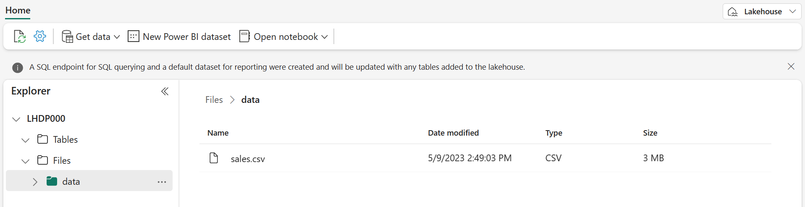

# Lab ~ Create a Microsoft Fabric Lakehouse

Large-scale data analytics solutions have traditionally been built around a *data warehouse*, in which data is stored in relational tables and queried using SQL. The growth in “big data” (characterized by high *volumes*, *variety*, and *velocity* of new data assets) together with the availability of low-cost storage and cloud-scale distributed compute technologies has led to an alternative approach to analytical data storage; the *data lake*. In a data lake, data is stored as files without imposing a fixed schema for storage. Increasingly, data engineers and analysts seek to benefit from the best features of both of these approaches by combining them in a *data lakehouse*; in which data is stored in files in a data lake and a relational schema is applied to them as a metadata layer so that they can be queried using traditional SQL semantics.

In Microsoft Fabric, a lakehouse provides highly scalable file storage in a *OneLake* store (built on Azure Data Lake Store Gen2) with a metastore for relational objects such as tables and views based on the open source *Delta Lake* table format. Delta Lake enables you to define a schema of tables in your lakehouse that you can query using SQL.

This lab takes approximately **30** minutes to complete.

!!! info "For this lab you need to navigate to QA Platform and login using the credentials provided"

!!! warning "It is important that you use an incognito/private mode browser tab and not your work or personal Microsoft login"

## Step 1: Signing in to Microsoft Fabric

In this lab, you will sign in to Microsoft Fabric using the email and password from the QA Platform.

1. Using an **incognito/private mode browser tab** navigate to the [Fabric portal](https://app.fabric.microsoft.com/) at: https://fabric.microsoft.com

2. Follow the prompts, and sign in with the user credentials from the QA Platform:
    - Email
    - Password

3. After signing in, you will be redirected to the Fabric home page:

    !!! example ""
        

## Step 2: Create a workspace

Before working with data in Fabric, you need to create a workspace with the Fabric trial enabled.

1. Navigate to the [Microsoft Fabric home page](https://app.fabric.microsoft.com/home?experience=fabric) in an incognito/private mode browser tab browser, and sign in with the Fabric credentials from the QA Platform.

2. In the menu bar on the left, select Workspaces (the icon looks similar to 🗇).

3. Create a **New workspace**:

    - Give it a name of your choice. For example: `fab_workspace`
    - Leave all other options as the default values
    - Click **Apply**

4. When your new workspace opens, it should be empty.

    !!! example ""
        

## Step 3: Create a lakehouse

Now that you have a workspace, it's time to create a data lakehouse into which you'll ingest data.

1. On the menu bar on the left, select **Create**. In the New page, under the *Data Engineering* section, select **Lakehouse**.
    - Give it a name of your choice. For example: `fab_lakehouse`

    !!! tip "If the **Create** option is not pinned to the sidebar, you need to select the ellipsis (…) option first."

    After a minute or so, a new empty lakehouse will be created.

    !!! example ""
        

2. View the new lakehouse, and note that the **Lakehouse explorer** pane on the left enables you to browse tables and files in the lakehouse:

    - The **Tables** folder contains tables that you can query using SQL semantics. Tables in a Microsoft Fabric lakehouse are based on the open source *Delta Lake* file format, commonly used in Apache Spark.

    - The **Files** folder contains data files in the OneLake storage for the lakehouse that aren't associated with managed delta tables. You can also create shortcuts in this folder to reference data that is stored externally.

Currently, there are no tables or files in this lakehouse.

## Step 4: Upload a file

Fabric provides multiple ways to load data into the lakehouse, including built-in support for pipelines that copy data from external sources and data flows (Gen 2) that you can define using visual tools based on Power Query. However one of the simplest ways to ingest small amounts of data is to upload files or folders from your local computer (or lab VM if applicable).

1. Download the [sales.csv](https://raw.githubusercontent.com/MicrosoftLearning/dp-data/main/sales.csv) file from https://raw.githubusercontent.com/MicrosoftLearning/dp-data/main/sales.csv, 

    - Save it as `sales.csv` on your local computer (or lab VM if applicable).

    !!! note
        - To download the file, open a new tab in the browser and paste in the URL.
        - Right click anywhere on the page containing the data and select "Save as" to save the data as a CSV file.

2. Return to the web browser tab containing your lakehouse

    - Click the **...** menu for the **Files** folder in the **Explorer pane** select **New subfolder**
    - Name the new subfolder: `data`
    - Click **Create**

3. In the **...** menu for the new **data** folder, select **Upload** and **Upload files**.

    - Then upload the **sales.csv** file from your local computer (or lab VM if applicable).

4. After the file has been uploaded, select the **Files/data** folder and verify that the **sales.csv** file has been uploaded, as shown here:

    !!! question ""
        

5. Select the **sales.csv** file to see a preview of its contents.

    !!! tip "If the **sales.csv** file does not automatically appear, in the **...** menu for the **data** folder, select **Refresh**."

## Step 5: Explore shortcuts

In many scenarios, the data you need to work with in your lakehouse may be stored in some other location. While there are many ways to ingest data into the OneLake storage for your lakehouse, another option is to instead create a shortcut. Shortcuts enable you to include externally sourced data in your analytics solution without the overhead and risk of data inconsistency associated with copying it.

1. In the **...** menu for the **Files** folder, select **New shortcut**.

2. View the available data source types for shortcuts.

    - Then close the **New shortcut** dialog box without creating a shortcut.

## Step 6: Load file data into a table

The sales data you uploaded is in a file, which you can work with directly by using Apache Spark code. However, in many scenarios you may want to load the data from the file into a table so that you can query it using SQL.

1. In the **Explorer** pane, select the **Files/data** folder so you can see the **sales.csv** file it contains.

2. In the **...** menu for the **sales.csv** file, select **Load to Tables > New table**.

    !!! example ""
        

3. In **Load to table** dialog box, set the table name to **sales** and confirm the load operation.

    - Then wait for the table to be created and loaded.

    !!! tip "If the **sales** table does not automatically appear, in the **...** menu for the **Tables** folder, select **Refresh**."

4. In the **Explorer** pane, select the **sales** table that has been created to view the data:

    !!! question ""
        

5. In the **...** menu for the **sales** table, select **View files** to see the underlying files for this table:

    !!! question ""
        

    > Files for a delta table are stored in *Parquet* format, and include a subfolder named `_delta_log` in which details of transactions applied to the table are logged.

## Step 7: Use SQL to query tables

When you create a lakehouse and define tables in it, a SQL endpoint is automatically created through which the tables can be queried using SQL `SELECT` statements.

1. At the top-right of the Lakehouse page, switch from Lakehouse to SQL analytics endpoint.

    - Then wait a short time until the SQL analytics endpoint for your lakehouse opens in a visual interface from which you can query its tables.

2. Use the **New SQL query** button to open a new query editor, and enter the following SQL query:

    ```sql
    SELECT Item, SUM(Quantity * UnitPrice) AS Revenue
    FROM sales
    GROUP BY Item
    ORDER BY Revenue DESC;
    ```

3. Use the :material-play: **Run** button to run the query and view the results, which should show the total revenue for each product.

    !!! question ""
        

## Step 8: Create a visual query

While many data professionals are familiar with SQL, those with Power BI experience can apply their Power Query skills to create visual queries.

1. On the toolbar, expand the **New SQL query** option and select **New visual query**.

2. Drag the **sales** table (under dbo > Tables) to the new visual query editor pane that opens to create a Power Query as shown here:

    !!! question ""
        

3. In the **Manage columns** menu, select **Choose columns**.

    - Then select only the **SalesOrderNumber** and **SalesOrderLineNumber** columns. Click **OK**

    !!! question ""
        

4. in the **Transform** menu, select **Group by**. Then group the data by using the following **Basic** settings:

    - **Group by**: SalesOrderNumber
    - **New column name**: `LineItems`
    - **Operation**: Count distinct values
    - **Column**: SalesOrderLineNumber (*if not greyed out*)

    When you're done, the results pane under the visual query shows the number of line items for each sales order.

    !!! question ""
        

---

## Clean up resources

In this exercise, you have created a lakehouse and imported data into it. You’ve seen how a lakehouse consists of files and tables stored in a OneLake data store. The managed tables can be queried using SQL, and are included in a default semantic model to support data visualizations.

If you've finished exploring your lakehouse, you can delete the workspace you created for this exercise.

1. Navigate to Microsoft Fabric in your browser.

2. In the bar on the left, select the icon for your workspace to view all of the items it contains.

3. Select **Workspace settings** and in the **General** section, scroll down and select **Remove this workspace**.

4. Select **Delete** to delete the workspace.

---
<small><b>Source:
https://microsoftlearning.github.io/mslearn-fabric/Instructions/Labs/01-lakehouse.html
</b></small>
