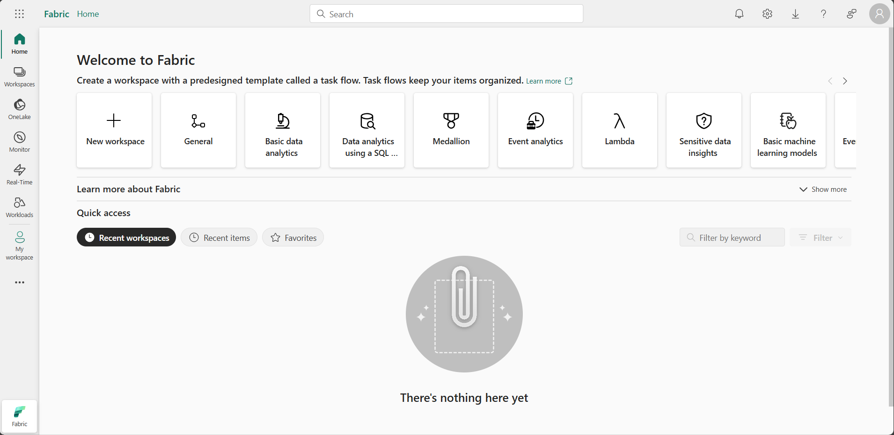

# Lab: Implement Deployment Pipelines

Implement deployment pipelines in Microsoft Fabric
Deployment pipelines in Microsoft Fabric let you automate the process of copying changes made to the content in Fabric items between environments like development, test, and production. You can use deployment pipelines to develop and test content before it reaches end users. In this exercise, you create a deployment pipeline, and assign stages to the pipeline. Then you create some content in a development workspace and use deployment pipelines to deploy it between the Development, Test and Production pipeline stages.

Note: To complete this exercise, you need to be an member of the Fabric workspace admin role. To assign roles see Roles in workspaces in Microsoft Fabric.

This lab takes approximately 20 minutes to complete.

!!! info "For this lab you need to navigate to QA Platform and login using the credentials provided"

!!! warning "It is important that you use an incognito/private mode browser tab and not your work or personal Microsoft login"

In this lab, you will sign in to Microsoft Fabric using the email and password from the QA Platform.

1. Using an **incognito/private mode browser tab** navigate to the [Fabric portal](https://app.fabric.microsoft.com/) at: https://fabric.microsoft.com

2. Follow the prompts, and sign in with the user credentials from the QA Platform:
    - Email
    - Password

After signing in, you will be redirected to the Fabric home page:

## Create workspaces

Create three workspaces.

1. Navigate to the [Microsoft Fabric home page](https://app.fabric.microsoft.com/home?experience=fabric) in an incognito/private mode browser tab browser, and sign in with the Fabric credentials from the QA Platform.

2. In the menu bar on the left, select Workspaces (the icon looks similar to 🗇).

3. Create a new workspace named: **Development**

4. Create a new workspace named: **Test**

5. Create a new workspace named: **Production**

6. Select the **Workspaces** icon on the menu bar on the left and confirm that there are three workspaces named: Development, Test, and Production

    !!! note
        If you are prompted to enter a unique name for the workspaces, append one or more random numbers to the words: Development, Test, or Production.

## Create a deployment pipeline

!!! note "To continue this lab ... use the MS Learn instructions"

<mark>https://microsoftlearning.github.io/mslearn-fabric/Instructions/Labs/21-implement-cicd.html</mark>
