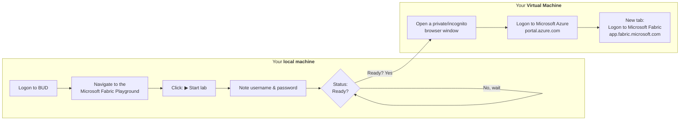

!!! warning "Start the lab on your own machine, not inside the VM."
    Once you have your username and password and the lab status shows **Ready**, switch to the VM to do the rest of the steps. Azure and Microsoft Fabric are accessed from inside the VM because corporate networks sometimes block those addresses (and file downloads) directly.

## Step 1: Start the QA Platform MS Fabric Playground

1. On your own machine (not the VM), navigate to the [QA Platform](https://bud.sso.app.qa.com/lab/microsoft-fabric-playground/) to access the **Microsoft Fabric Playground**.

2. Click **Start** to start the lab.

3. Make a note of your allocated **username** and **password**.

!!! warning "Wait until the lab status shows **Ready**, before continuing with the next step!"

!!! tip "Switch to your Virtual Machine to complete the steps listed below."

## Step 2: Logon to Microsoft Azure

1. In your VM open a **private browsing window** (InPrivate in Edge, Incognito in Chrome).

2. Navigate to the [Microsoft Azure home page](https://portal.azure.com/) at: https://portal.azure.com

3. When prompted, sign in using:

    - **Username** from the QA Platform (used as the email address)
    - **Password** from the QA Platform (used as a Temporary Access Pass)

    - If prompted to "Stay signed in?", select **No**.

    !!! success "You are now signed in to the **Azure portal**. This confirms your lab account is active."

## Step 3: Logon to Microsoft Fabric

1. In the same private browsing window, **open a new tab**.

2. Navigate to the [Microsoft Fabric home page](https://app.fabric.microsoft.com/home?experience=fabric-developer) at: https://app.fabric.microsoft.com/home?experience=fabric-developer

3. If prompted, **re-enter your email address** to confirm access to Microsoft Fabric.

    !!! success "You are now signed in to **Microsoft Fabric**."

    !!! abstract ""
        

    !!! warning "You do not have to signup to a Microsoft Fabric Trial!"
        - If asked to do so please let your trainer know.

