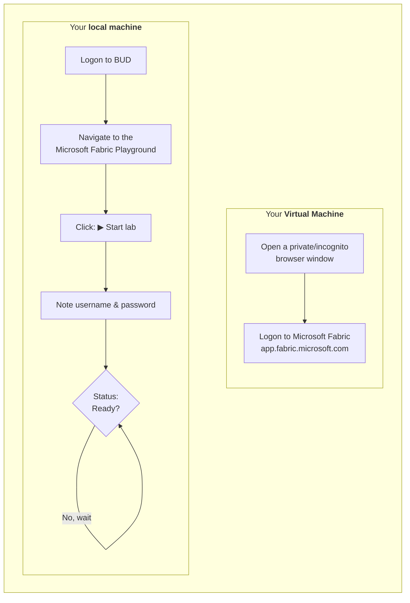
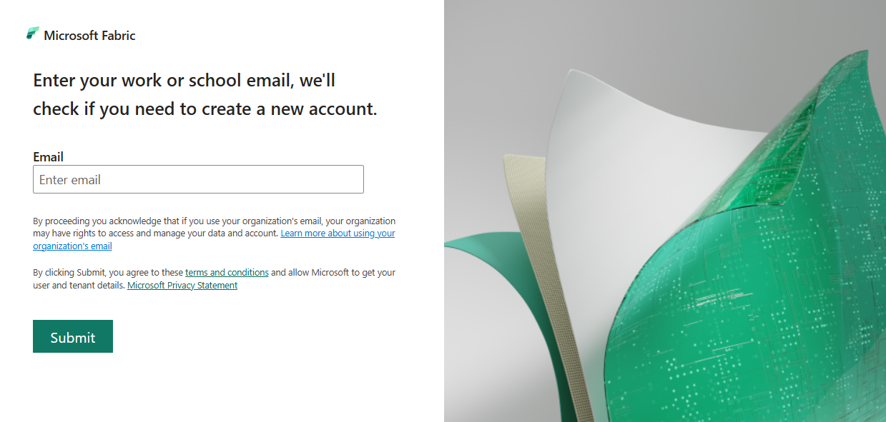

# MS Fabric Playground ~ VM Login Instructions

!!! warning "Start the lab on your own machine, not inside the VM."
    - Once you have your username and password and the lab status shows **Ready**, switch to the VM to do the rest of the steps.
    - Microsoft Fabric is accessed from inside the VM because corporate networks sometimes block that address (and file downloads) directly.

```mermaid
flowchart TD
    subgraph WRAPPER[" "]
        direction LR
        subgraph LOCAL["Your <b>local machine</b>"]
            direction TB
            A1["Logon to BUD"]
            A2["Navigate to the<br/>Microsoft Fabric Playground"]
            A3["Click: ▶ Start lab"]
            B["Note username & password"]
            C{"Status:<br/>Ready?"}
        end

        subgraph VM["Your <b>Virtual Machine</b>"]
            direction TB
            D["Open a private/incognito<br/>browser window"]
            E["Logon to Microsoft Fabric<br/>app.fabric.microsoft.com"]
        end

        LOCAL ~~~ VM
    end

    A1 --> A2 --> A3 --> B --> C
    C -- No, wait --> C

    D --> E
```

## Step 1: Start the QA Platform MS Fabric Playground

1. On your own machine (not the VM), navigate to the [QA Platform](https://bud.sso.app.qa.com/lab/microsoft-fabric-playground/) to access the **Microsoft Fabric Playground**.

2. Click **Start** to start the lab.

3. Make a note of your allocated **Username** and **Password**.

!!! warning "Wait until the lab status shows **Ready** with a green tick, before continuing with the next step!"
    - **Ready to log in** with a grey tick and a percentage is not ready - keep waiting.
    - This can take up to 15 minutes from the time you start the lab. The provisioning assigns a Fabric licence to your lab user account.

!!! tip "Switch to your Virtual Machine to complete the steps listed below."

## Step 2: Logon to Microsoft Fabric

1. In your VM open a **private browsing window** (InPrivate in Edge, Incognito in Chrome).

2. Navigate to the [Microsoft Fabric home page](https://app.fabric.microsoft.com) at: https://app.fabric.microsoft.com

3. When asked to enter your email, paste the **Username** from the QA Platform into the **Email** box and select **Submit**.

    !!! abstract ""
        

    !!! warning "Do not sign up for a Microsoft Fabric Trial!"
        - If you are asked to do so, please let your trainer know.

4. When prompted for a **Temporary Access Pass**, use the **Password** from the QA Platform.

    - If prompted to "Stay signed in?", select **No**.

    !!! success "You are now signed in to **Microsoft Fabric**."

    !!! abstract ""
        

    !!! tip "If Microsoft Fabric opens in the Power BI view instead:"
        - Select the icon at the bottom-left of the screen and choose **Fabric**.

