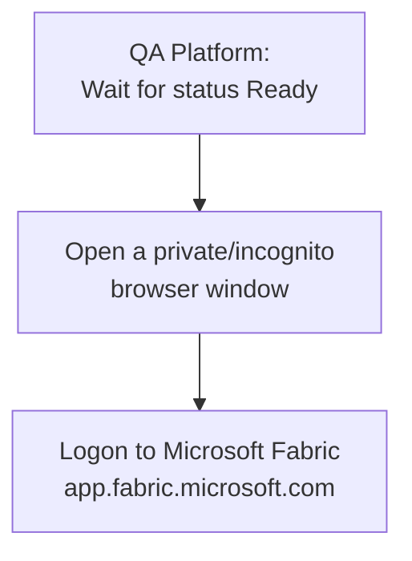

```mermaid
flowchart TD
    A["QA Platform:<br/>Wait for status Ready"]
    B["Open a private/incognito<br/>browser window"]
    C["Logon to Microsoft Fabric<br/>app.fabric.microsoft.com"]

    A --> B --> C
```

## Step 1: Access Microsoft Fabric

In this lab, you will access Microsoft Fabric using a temporary lab account provided by the QA Platform.

!!! note
    The **Open** button in the QA Platform opens the Azure portal. You do not need to use it - sign in to Microsoft Fabric directly instead.

1. In the QA Platform, wait until the lab status shows **Ready** with a green tick.

    - This can take up to 15 minutes from the time you start the lab. The provisioning assigns a Fabric licence to your lab user account.

    !!! warning "**Ready to log in** with a grey tick and a percentage is not ready - keep waiting!"

2. Make a note of your allocated **Username** and **Password**.

## Step 2: Logon to Microsoft Fabric

1. Open a **private browsing window** (InPrivate in Edge, Incognito in Chrome).

2. Navigate to the [Microsoft Fabric home page](https://app.fabric.microsoft.com) at: https://app.fabric.microsoft.com

3. When asked to enter your email, paste the **Username** from the QA Platform into the **Email** box and select **Submit**.

    !!! abstract ""
        

    !!! warning "Do not sign up for a Microsoft Fabric Trial!"
        - If you are asked to do so, please let your trainer know.

4. When prompted for a **Temporary Access Pass**, use the **Password** from the QA Platform.

    - If prompted to "Stay signed in?", select **No**. This ensures the session ends when the private window is closed.

5. After signing in, you should be redirected to the **Microsoft Fabric home page**:

    !!! abstract ""
        

    !!! tip "If Microsoft Fabric opens in the Power BI view instead:"
        - Select the icon at the bottom-left of the screen and choose **Fabric**.

